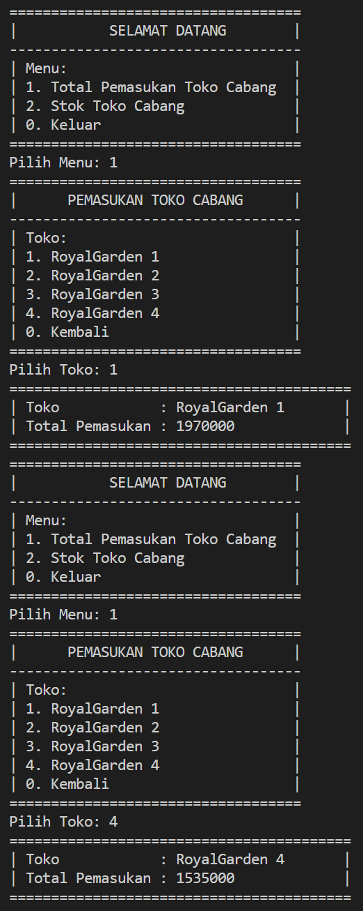

# Laporan Praktikum Pertemuan 1

<b>NAMA : GHETSA RAMADHANI RISKA ARRYANTI<b> 
<b>KELAS : TI-1H<b> 
<b>NIM : 2341720004<b> 
<b>ABSEN : 12<b> 

## Hasil Output Praktikum Pemilihan

Hasil output dari Program Menghitung Nilai Akhir :

1. Status : LULUS 
   

2. Status : TIDAK LULUS 
   

## Hasil Output Praktikum Perulangan

Hasil output dari Program Perulangan : 

## Hasil Output Praktikum Array

Hasil output dari Program Menghitung IP Semester : 

## Hasil Output Praktikum Fungsi

Hasil output dari Program Toko Bunga :

1. Pemasukan CABANG 
   

2. STOK bunga tiap cabang 
   

## Tugas 1

Hasil output dari Program Plat MobilA :

1. Kode huruf BENAR 
   
2. Kode huruf SALAH 
   

## Tugas 2

Hasil output dari Program JKW :

1. KECEPATAN 
   
2. JARAK 
   
3. WAKTU 
   
