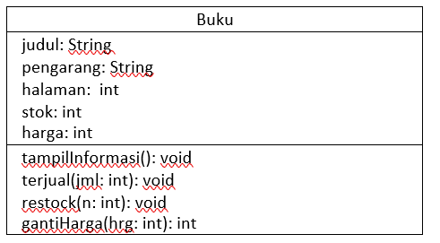
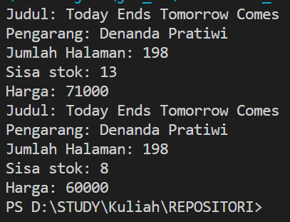
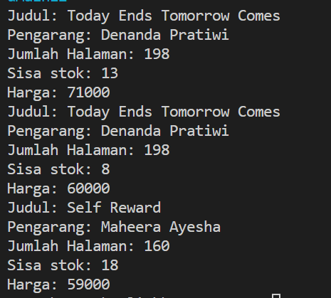
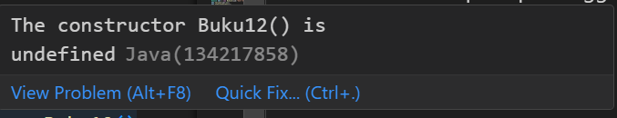
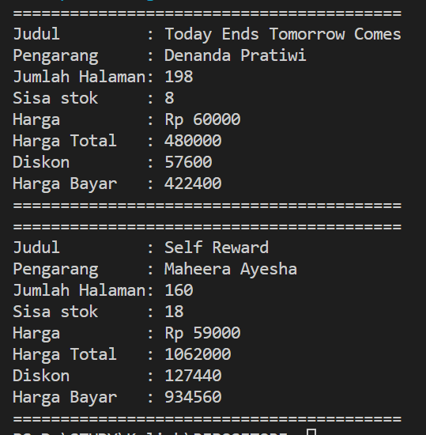
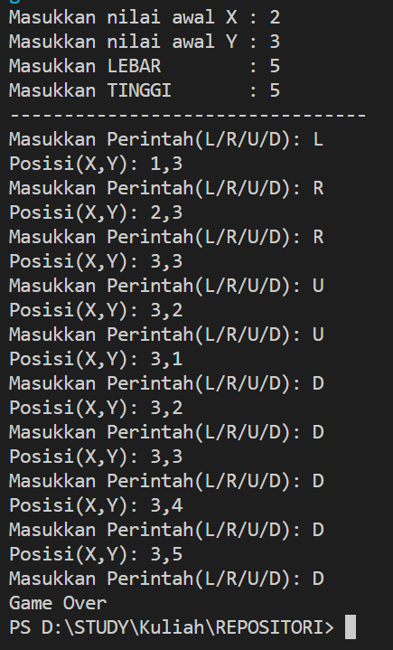

# Laporan Praktikum Pertemuan 2

<b>NAMA : GHETSA RAMADHANI RISKA ARRYANTI</b><br>
<b>KELAS : TI-1H</b><br>
<b>NIM : 2341720004</b><br>
<b>ABSEN : 12</b><br>

## 1.	Tujuan Praktikum
Setelah melakukan materi praktikum ini, mahasiswa mampu:
1.	Mengenal objek dan class sebagai konsep mendasar pada pemrograman berorientasi objek
2.	Mendeklarasikan class, atribut dan method
3.	Membuat objek (instansiasi)
4.	Mengakses atribut dan method dari suatu objek
5.	Menerapkan konstruktor


## 2.	Praktikum
### Percobaan 1: 
Waktu Percobaan : 50 Menit
Pada Percobaan 1 ini dilakukan pembuatan class beserta atribut dan method yang dimilikinya.<br>
Perhatikan Class Diagram berikut ini:<br>


#### Hasil Percobaan
- Source code:<br>
```package Algoritma.Pertemuan02;

public class Buku12 {
    String judul, pengarang;
    int halaman, stok, harga;

    void tampilInformasi() {
        System.out.println("Judul: " + judul);
        System.out.println("Pengarang: " + pengarang);
        System.out.println("Jumlah Halaman: " + halaman);
        System.out.println("Sisa stok: " + stok);
        System.out.println("Harga: " + harga);
    }

    void terjual(int jml) {
        stok -= jml;
    }

    void restok(int jml) {
        stok += jml;
    }

    void gantiHarga(int hrg) {
        harga = hrg;
    }

}
```

- Output File Buku12.java

---
- Pertanyaan: <br>
    1. Sebutkan dua karakteristik class atau object!<br>
    2. Perhatikan class Buku pada Praktikum 1 tersebut, ada berapa atribut yang dimiliki oleh class Buku? Sebutkan apa saja atributnya!<br>
    3. Ada berapa method yang dimiliki oleh class tersebut? Sebutkan apa saja methodnya!<br>
    4.	Perhatikan method terjual() yang terdapat di dalam class Buku. Modifikasi isi method tersebut sehingga proses pengurangan hanya dapat dilakukan jika stok masih ada (lebih besar dari 0)!<br>
    5.	Menurut Anda, mengapa method restock() mempunyai satu parameter berupa bilangan int?<br>
- Jawaban: <br>
    1. Object memiliki karakteristik, yaitu atribut dan behavior.<br>
    2. Ada 5, yaitu judul, pengarang, halaman dan stok.<br>
    3. Ada 4 method, yaitu tampilInformasi(), terjual(int jml), restock(int n), gantiHarga(int hrg)<br>
    4.	
    ```
        void terjual(int jml) {
        if (jml > 0) {
            stok -= jml;
        } 
        } 
    ```
    5.	Parameter tersebut digunakan untuk mengetahui jumlah buku saat ini. Dan kenapa int, karena tipedata jumlah juga merupakan int<br>

### Percobaan 2 :

- Source code:<br>
```
package Algoritma.Pertemuan02;

public class BukuMain12 {
    public static void main(String[] args) {
        Buku12 bk1 = new Buku12();
        bk1.judul = "Today Ends Tomorrow Comes";
        bk1.pengarang = "Denanda Pratiwi";
        bk1.halaman = 198;
        bk1.stok = 13;
        bk1.harga = 71000;

        bk1.tampilInformasi();
        bk1.terjual(5);
        bk1.gantiHarga(60000);
        bk1.tampilInformasi();

    }
}
```
- Output File BukuMain12.java<br>


- Pertanyaan: <br>
    1.	Pada class BukuMain, tunjukkan baris kode program yang digunakan untuk proses instansiasi! Apa nama object yang dihasilkan?<br>
    2.	Bagaimana cara mengakses atribut dan method dari suatu objek?<br>
    3.	Mengapa hasil output pemanggilan method tampilInformasi() pertama dan kedua berbeda?<br>


- Jawaban: <br>
    1.	Instansiasi:<br>
    ```Buku12 bk1 = new Buku12();``` <br>
    Object:<br>
        ```bk1.judul = "Today Ends Tomorrow Comes";
        bk1.pengarang = "Denanda Pratiwi";
        bk1.halaman = 198;
        bk1.stok = 13;
        bk1.harga = 71000;```
    2.	```
        bk1.judul = "Today Ends Tomorrow Comes"; // Mengakses atribut judul
        bk1.tampilInformasi(); // Memanggil method tampilInformasi()
        ```
    3.	Hasil output berbeda karena perbedaan nilai atribut dari objek pada pemanggilan pertama dan kedua<br>
### Percobaan 3 :
- Source code:<br>
```
package Algoritma.Pertemuan02;

public class Buku12 {
    String judul, pengarang;
    int halaman, stok, harga;

    void tampilInformasi() {
        System.out.println("Judul: " + judul);
        System.out.println("Pengarang: " + pengarang);
        System.out.println("Jumlah Halaman: " + halaman);
        System.out.println("Sisa stok: " + stok);
        System.out.println("Harga: " + harga);
    }

    void terjual(int jml) {
        if (jml > 0) {
            stok -= jml;
        }
    }

    void restok(int jml) {
        stok += jml;
    }

    void gantiHarga(int hrg) {
        harga = hrg;
    }

    public Buku12() {

    }

    public Buku12(String jud, String pg, int hal, int stok, int har) {
        judul = jud;
        pengarang = pg;
        halaman = hal;
        this.stok = stok;
        harga = har;
    }
}
```


- Output File Buku12.java

---
- Pertanyaan: <br>
    1.	Pada class Buku di Percobaan 3, tunjukkan baris kode program yang digunakan untuk mendeklarasikan konstruktor berparameter!<br>
    2.	Perhatikan class BukuMain. Apa sebenarnya yang dilakukan pada baris program berikut?<br>
    ```
    Buku bk2 = new Buku("Self Reward", "Maheera Ayesha", 160, 59000);
    ```
    3.	Hapus konstruktor default pada class Buku, kemudian compile dan run program. Bagaimana hasilnya? Jelaskan mengapa hasilnya demikian!<br>
    4.	Setelah melakukan instansiasi object, apakah method di dalam class Buku harus diakses secara berurutan? Jelaskan alasannya!<br>
    5.	Buat object baru dengan nama buku <NamaMahasiswa> menggunakan konstruktor berparameter dari class Buku!<br>

- Jawaban: <br>
    1.	Pendeklarasian konstruktor berparameter:<br>
    ```
    public Buku12(String jud, String pg, int hal, int stok, int har) {
    judul = jud;
    pengarang = pg;
    halaman = hal;
    this.stok = stok;
    harga = har;
    }
    ```
    2.	Kode tersebut digunakan untuk instansiasi bk2 dari kelas Buku yang berparameter.<br>
    3.	Jika konstruktor default dihapus akan terjadi error karena tidak ada konstruktor tanpa parameter yang tersedia untuk digunakan saat membuat objek.<br>
    
        

    4.	Tidak perlu, setelah melakukan instansiasi bisa langsung diakses<br>
    5.	
    ```
    Buku12 bukuMahasiswa = new Buku12("JudulBuku", "PengarangBuku", 200, 10, 50000);
    ```

## PRAKTIKUM 
### Percobaan 1 :
- Source Code
    1. Buku12.java
  ```
  int hitungHargaTotal(int hrg, int jm) {
        int tot = hrg * jm;
        return tot;
    }

    int hitungDiskon(int ttl) {
        int total = ttl;
        int dis;
        if (total > 150000) {
            dis = 12 / 100;
        } else if (total >= 75000 && total <= 150000) {
            dis = 5 / 100;
        } else {
            dis = 0;
        }

        return dis;
    }

    int hitungHargaBayar(int tot, int dis) {
        int hargaDis = tot * dis;
        int hargaBayar = tot - hargaDis;

        return hargaBayar;
    }
  ```

  2. BukuMain12.java
   ```
   package Algoritma.Pertemuan02;

    public class BukuMain12 {
        public static void main(String[] args) {
            Buku12 bk1 = new Buku12();
            bk1.judul = "Today Ends Tomorrow Comes";
            bk1.pengarang = "Denanda Pratiwi";
            bk1.halaman = 198;
            bk1.stok = 13;
            bk1.harga = 71000;

            bk1.terjual(5);
            bk1.gantiHarga(60000);
            bk1.hitungHargaTotal(5);
            bk1.hitungDiskon();
            bk1.hitungHargaBayar();
            bk1.tampilInformasi();

            Buku12 bk2 = new Buku12("Self Reward", "Maheera Ayesha", 160, 29, 59000);
            bk2.terjual(11);
            bk2.hitungHargaTotal(11);
            bk2.hitungDiskon();
            bk2.hitungHargaBayar();
            bk2.tampilInformasi();

        }
    }
   ```
- Hasil Output<br>
  <br>
### Percobaan 2 :<br>
- Source Code<br>
  1. Dragon.java
    ```
        package Algoritma.Pertemuan02;

        public class Dragon {
            int x, y, width, height;

            void moveLeft() {
                x -= 1;
                if (x < 0) {
                    detectCollision();

                }
            }

            void moveRight() {
                x += 1;
                if (x > width) {
                    detectCollision();
                }
            }

            void moveUp() {
                y -= 1;
                if (y < 0) {
                    detectCollision();
                }
            }

            void moveDown() {
                y += 1;
                if (y > height) {
                    detectCollision();
                }
            }

            void printPosition() {
                System.out.println("Posisi(X,Y): " + x + "," + y);
            }

            void detectCollision() {
                System.out.println("Game Over");
                System.exit(0);
            }
        }
    ```
    2. DragonMain.java
    ```
        package Algoritma.Pertemuan02;

        import java.util.Scanner;

        import javax.sound.midi.Soundbank;

        public class DragonMain {
            public static void main(String[] args) {
                Scanner input = new Scanner(System.in);

                System.out.print("Masukkan nilai awal X : ");
                int x = input.nextInt();
                System.out.print("Masukkan nilai awal Y : ");
                int y = input.nextInt();
                System.out.print("Masukkan LEBAR        : ");
                int width = input.nextInt();
                System.out.print("Masukkan TINGGI       : ");
                int height = input.nextInt();

                Dragon koor = new Dragon();
                koor.x = x;
                koor.y = y;
                koor.width = width;
                koor.height = height;

                System.out.println("---------------------------------");
                while (x > 0 || y > 0 || x < width || y < height) {
                    System.out.print("Masukkan Perintah(L/R/U/D): ");
                    char perintah = input.next().charAt(0);

                    switch (perintah) {
                        case 'L':
                            koor.moveLeft();
                            break;
                        case 'R':
                            koor.moveRight();
                            break;
                        case 'U':
                            koor.moveUp();
                            break;
                        case 'D':
                            koor.moveDown();
                            break;
                        default:
                            break;
                    }

                    koor.printPosition();
                }
            }
        }
    ```
- Hasil Output<br>
  
