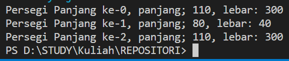
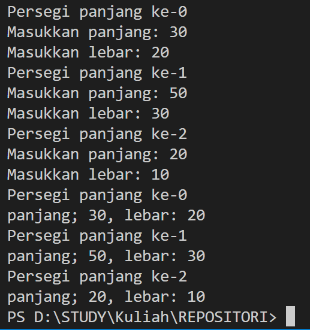
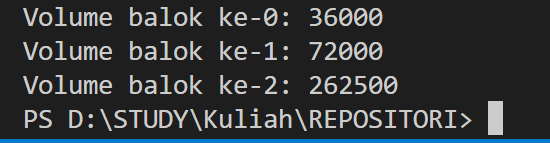
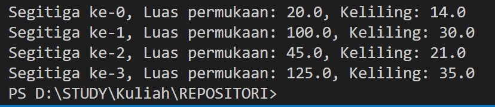
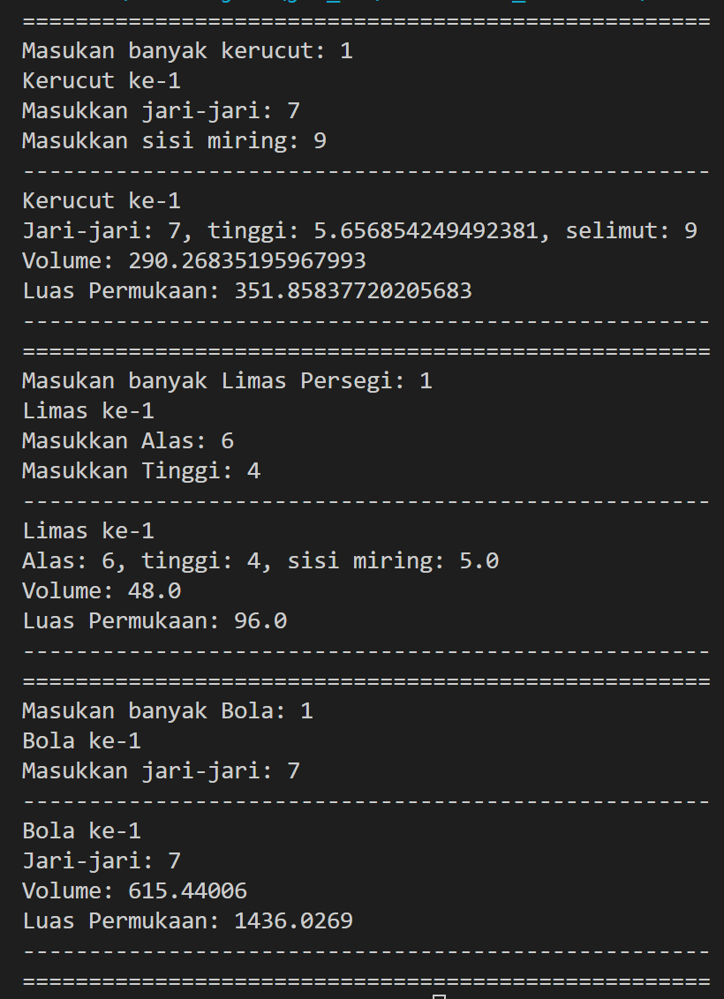
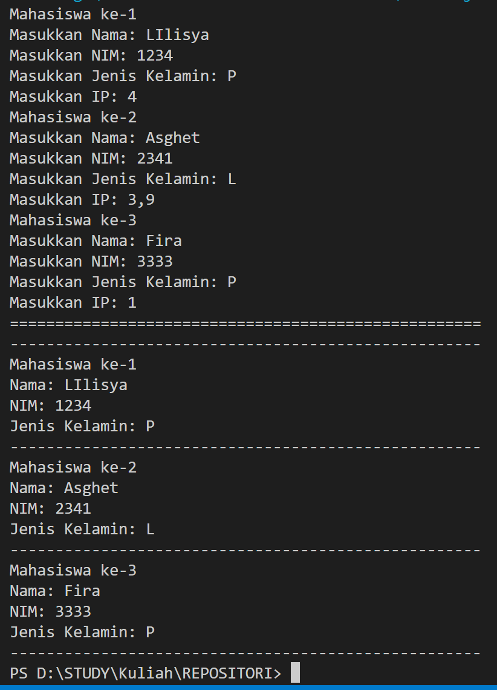
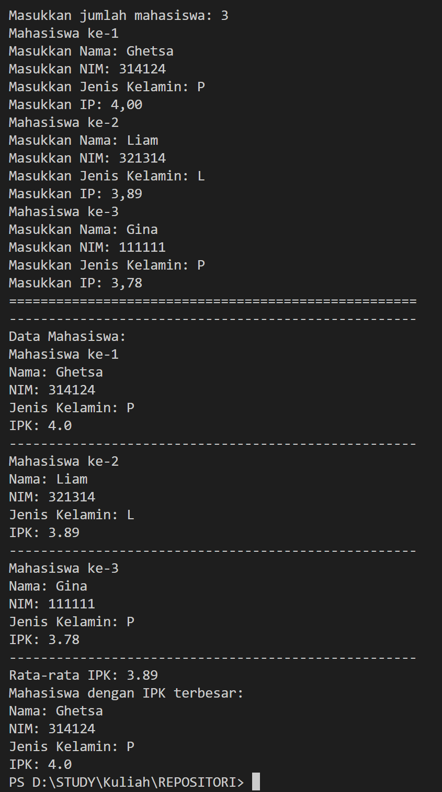

# Laporan Praktikum Pertemuan 3

<b>NAMA : GHETSA RAMADHANI RISKA ARRYANTI</b><br>
<b>KELAS : TI-1H</b><br>
<b>NIM : 2341720004</b><br>
<b>ABSEN : 12</b><br>

## 1.	Praktikum
### Percobaan 1 : Membuat Array dari Object, Mengisi dan Menampilkan
 
Waktu Percobaan : 50 Menit <br>
Didalam praktikum ini, kita akan mempraktekkan bagaimana membuat array dari object, 
kemudian mengisi dan menampilkan array tersebut<br>

#### Hasil Percobaan

- Output File ArrayObjects.java untuk percobaan 1<br>
<center></center>

---
- Pertanyaan: <br>
    1. Berdasarkan uji coba 3.2, apakah class yang akan dibuat array of object harus selalu memiliki
    atribut dan sekaligus method?Jelaskan!<br>
    2. Apakah class PersegiPanjang memiliki konstruktor? Jika tidak, kenapa dilakukan pemanggilan konstruktur pada baris program berikut :<br>
    ```
    ppArray[1] = new PersegiPanjang();
    ```
    3. Apa yang dimaksud dengan kode berikut ini:<br>
    ```
    PersegiPanjang[] ppArray = new PersegiPanjang[3];
    ```
    4. Apa yang dimaksud dengan kode berikut ini:<br>
    ```
    ppArray[1] = new PersegiPanjang[3];
    ppArray[1].panjang = 80;
    ppArray[1].lebar = 40;
    ```
    5. Mengapa class main dan juga class PersegiPanjang dipisahkan pada uji coba 3.2?<br>


- Jawaban: <br>
    1. class yang akan dibuat array of object tidak harus selalu memiliki atribut dan method. Jika class yang akan dibuat menjadi array of object tidak membutuhkan atribut & method, maka tidak perlu menambahkannya <br>
    2. class PersegiPanjang memiliki kontruktor default sehingga tetap harus melakukan pemanggilan<br>
    3. Kode tersebut digunakan untuk instansiasi dari array `ppArray` untuk menampung objek dari class `PersegiPanjang` yang memiliki 3 elemen<br>
    4. `ppArray[1] = new PersegiPanjang[3];`: digunakan untuk membuat sebuah array objek PersegiPanjang<br>
        `ppArray[1].panjang = 80;`: digunakan untuk mengatur nilai panjang dari objek pertama di dalam array yang disimpan di indeks 1<br>
        `ppArray[1].lebar = 40;`: Baris ini mengatur nilai lebar dari objek pertama di dalam array yang disimpan di indeks 1 <br>
    5.	Pemisahan antara class main dan class PersegiPanjang dilakukan untuk meningkatkan modularitas, keterbacaan, pengujian, dan pemeliharaan kode.<br>

### Percobaan 2 :

- Output File ArrayObject.java<br>


- Pertanyaan: <br>
    1.	Apakah array of object dapat diimplementasikan pada array 2 Dimensi? <br>
    2.	Jika jawaban soal no satu iya, berikan contohnya! Jika tidak, jelaskan!
    <br>
    3.	Jika diketahui terdapat class Persegi yang memiliki atribut sisi bertipe integer, maka kode dibawah ini akan memunculkan error saat dijalankan. Mengapa?<br>
    4.	Modifikasi kode program pada praktikum 3.3 agar length array menjadi inputan dengan Scanner!<br>
    5.	Apakah boleh Jika terjadi duplikasi instansiasi array of objek, misalkan saja instansiasi dilakukan pada ppArray[i] sekaligus ppArray[0]?Jelaskan !<br>


- Jawaban: <br>
    1.	Ya, array of object dapat diimplementasikan pada array 2 Dimensi.
    
    2. `PersegiPanjang[][] array2D = new PersegiPanjang[2][2];`

    3. Karena class Persegi tidak didefinisikan, maka pemanggilan objek Persegi akan menghasilkan error.

    4. Modifikasi dapat dilakukan dengan menambahkan kode:
        ```
        System.out.print("Masukkan banyak persegi panjang: ");
        int j = sc.nextInt();
        PresegiPanjang[] ppArray = new PresegiPanjang[j];
        ```

    5. Bisa, jika instansiasi dilakukan dengan menggunakan looping<br>


### Percobaan 3 :

- Output File ArrayBalok12.java

---
- Pertanyaan: <br>
    1.	Dapatkah konstruktor berjumlah lebih dalam satu kelas? Jelaskan dengan contoh!<br>

    2.	Jika diketahui terdapat class Segitiga seperti berikut ini:
        ```
        Public class segitiga{ 
            public int alas; 
            public int tinggi;
        }
        ```
        Tambahkan konstruktor pada class Segitiga tersebut yang berisi parameter int a, int t yang masing-masing digunakan untuk mengisikan atribut alas dan tinggi

    3. Tambahkan method hitungLuas() dan hitungKeliling() pada class Segitiga tersebut. Asumsi segitiga adalah segitiga siku-siku. (Hint: Anda dapat menggunakan bantuan library Math pada Java untuk mengkalkulasi sisi miring)
   
    4. Pada fungsi main, buat array Segitiga sgArray yang berisi 4 elemen, isikan masing-masing atributnya sebagai berikut: sgArray ke-0 alas: 10, tinggi: 4 sgArray ke-1 alas: 20, tinggi: 10 sgArray ke-2 alas: 15, tinggi: 6 sgArray ke-3 alas: 25, tinggi: 10

    5. Kemudian menggunakan looping, cetak luas dan keliling dengan cara memanggil method hitungLuas() dan hitungKeliling().


- Jawaban: <br>
    1. Bisa, kelas bisa memiliki banyak kostruktor jika memang kelas tersebut membutuhkannya. Contoh:
   ```
        public balok(int p, int l, int t) {
        panjang = p;
        lebar = l;
        tinggi = t;    
        }
            public int hitungVolume(){
            return panjang * lebar * tinggi;
        }
   ```
    2. Lihat file Segitiga.java 
    3. Lihat file Segitiga.java 
    4. Lihat file Segitiga.java 
    5. 


## PRAKTIKUM 
### Latihan 1 :
- Soal<br>
    Buatlah program yang dapat menghitung luas permukaan dan volume bangun ruang kerucut, 
    limas segi empat sama sisi, dan bola. Buatlah 3 (tiga) class sesuai dengan jumlah jenis bangun 
    ruang. Buatlah satu main class untuk membuat array of objects yang menginputkan atribut-atribut yang ada menggunakan konstruktor semua bangun ruang tersebut. Dengan ketentuan:
    a. Buat looping untuk menginputkan masing-masing atributnya, kemudian tampilkan 
    luas permukaan dan volume dari tiap jenis bangun ruang tersebut.
    b. Pada kerucut, inputan untuk atribut hanya jari-jari dan sisi miring
    c. Pada limas segi empat sama sisi, inputan untuk atribut hanya panjang sisi alas dan 
    tinggi limas
    d. Pada bola, inpuntan untuk atribut hanya jari-jari
- Hasil Output<br>
  <br>

### Latihan 2 :<br>
- Soal<br>
    Sebuah kampus membutuhkan program untuk menampilkan informasi mahasiswa berupa nama, 
    nim, jenis kelamin dan juga IPK mahasiswa. Program dapat menerima input semua informasi 
    tersebut, kemudian menampilkanya kembali ke user. Implementasikan program tersebut jika 
    dimisalkan terdapat 3 data mahasiswa yang tersedia.
- Hasil Output<br>
  

### Latihan 3 :<br>
- Soal<br>
    Modifikasi program Latihan no.2 di atas, sehingga bisa digunakan untuk menghitung rata-rata IPK, 
    serta menampilkan data mahasiswa dengan IPK terbesar! (gunakan method untuk masing-masing 
    proses tersebut)
- Hasil Output<br>
  
