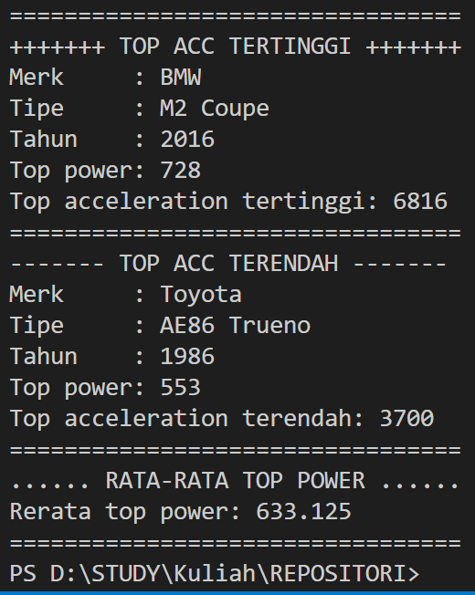

# Laporan Praktikum Pertemuan 5

<b>NAMA : GHETSA RAMADHANI RISKA ARRYANTI</b><br>
<b>KELAS : TI-1H</b><br>
<b>NIM : 2341720004</b><br>
<b>ABSEN : 12</b><br>

## 1.	Praktikum
### Percobaan 1 : Menghitung Nilai Faktorial dengan Algoritma Brute Force dan Divide and Conquer
 
Waktu Percobaan : 50 Menit <br>
Didalam praktikum ini, kita akan membuat program class dalam Java. Untuk menghitung nilai 
faktorial suatu angka menggunakan 2 jenis algoritma, Brute Force dan Divide and Conquer.<br>

#### Hasil Percobaan

- Output File Faktorial.java untuk percobaan 1<br>
<center></center>

---
- Pertanyaan: <br>
    1. Pada base line Algoritma Divide Conquer untuk melakukan pencarian nilai faktorial, jelaskan perbedaan bagian kode pada penggunaan if dan else!<br>
    2. Apakah memungkinkan perulangan pada method faktorialBF() dirubah selain menggunakan for? Buktikan!<br>
    3. Jelaskan perbedaan antara `fakto *= i;` dan `int fakto = n * faktorialDC(n-1);` !<br>


- Jawaban: <br>
    1. `if (n==1)` digunakan saat kondisi variable `n` bernilai sama dengan 1 terpenuhi dan akan return nilai 1. Sementara `else` digunakan saat kondisi `n==1` tidak terpenuhi dan akan melakukan faktorisasi dengan return nilai variable fakto.<br>
    2. Perulangan faktorialBF() bisa menggunakan perulangan selain for, misal menggunakan while<br>
        ``` 
        int faktorialBF(int n){
            int fakto = 1;
            int i = 1;

            while (i <= n){
                fakto *= i;
                i++;
            }
            return fakto;
        }
        ```
    3. `fakto *= i;` digunakan untuk mengalikan nilai `fakto` dengan nilai `i`. Sementara `int fakto = n * faktorialDC(n-1);` merupakan perkalian rekursif dimana akan mengurangi 1 setiap melakukan perulangan sampai nilai menjadi `n==1` <br>
    

### Percobaan 2 :

- Output File Pangkat.java<br>


- Pertanyaan: <br>
    1.	Jelaskan mengenai perbedaan 2 method yang dibuat yaitu PangkatBF() dan PangkatDC()! <br>
    2.	Apakah tahap combine sudah termasuk dalam kode tersebut?Tunjukkan!<br>
    3.	Modifikasi kode program tersebut, anggap proses pengisian atribut dilakukan dengan konstruktor.<br>
    4.	Tambahkan menu agar salah satu method yang terpilih saja yang akan dijalankan menggunakan switch-case!<br>


- Jawaban: <br>
    1. PangkatBF() : menggunakan metode Brute Force, yang akan mengalikan bilangan `a` dengan bilangan itu sendiri (yaitu `a`) sebanyak `n`. <br><br> PangkatDC() : menggunakan metode Divide and Conquer, dimana akan melakukan perkalian rekursif. jika `(n == 0)` maka akan return nilai 1, dan jika kondisi itu tidak terpenuhi, akan membagi `n/2` dan mengalikan hasilnya dengan dirinya sendiri. Jika `n` ganjil, hasilnya akan dikalikan dengan a.<br>
    2. Tahap combine atau penggabungan tidak ditunjukkan secara langsung, tapi terdapat pada `pangkatDC()`
    ```
    int hasilBagian = pangkatDC(a, n / 2);
    if (n % 2 == 0) {
        return hasilBagian * hasilBagian;
    } else {
        return hasilBagian * hasilBagian * a;
    }

    ```
    3. 
            Pangkat(int angka, int pangkat) {
                this.nilai = angka;
                this.pangkat = pangkat;
            }
    <br>
    4. <br>


### Percobaan 3 :

- Output File Sum.java

---
- Pertanyaan: <br>
    1.	 Mengapa terdapat formulasi return value berikut?Jelaskan!<br> `return lsum + rsum + arr[mid];`<br>
    2.	Kenapa dibutuhkan variable mid pada method TotalDC()?<br>
    3. Program perhitungan keuntungan suatu perusahaan ini hanya untuk satu perusahaan saja. Bagaimana cara menghitung sekaligus keuntungan beberapa bulan untuk beberapa perusahaan.(Setiap perusahaan bisa saja memiliki jumlah bulan berbeda-beda)? Buktikan dengan program!<br>


- Jawaban: <br>
    1. `return lsum + rsum + arr[mid];` digunakan mengembalikan nilai dari total keuntungan yang sudah dijumlahkan terlebih dahulu<br>
    2. variable `mid` digunakan untuk mencari nilai tengah yang akan digunakan untuk membagi permasalahan menjadi 2 bagian<br>
    3. 
    ```
    public static void main(String[] args) {
        Scanner sc = new Scanner(System.in);
        Scanner dob = new Scanner(System.in);

        System.out.println("========================================================");
        System.out.println("|         PROGRAM HITUNG KEUNTUNGAN PERUSAHAAN         |");
        System.out.println("--------------------------------------------------------");
        System.out.print("Masukkan Banyak Perusahaan : ");
        int perusahaan = sc.nextInt();
        Sum sm[] = new Sum[perusahaan];

        for (int i = 0; i < perusahaan; i++) {
            System.out.println("--------------------------------------------------------");
            System.out.print("Masukkan Jumlah Bulan Perusahaan " + (i + 1) + " : ");
            int elemen = sc.nextInt();
            sm[i] = new Sum(elemen);
            System.out.println("--------------------------------------------------------");
            System.out.println("Satuan juta, misal 1,1 -> gunakan koma(,)");
            for (int j = 0; j < sm[i].elemen; j++) {
                System.out.print("Masukkan Keuntungan Bulan ke-" + (j + 1) + " : ");
                sm[i].keuntungan[j] = dob.nextDouble();
            }
        }

        System.out.println("--------------------------------------------------------");
        System.out.println("Algoritma Brute Force");
        for (int i = 0; i < sm.length; i++) {
            System.out.println(
                    "Total Keuntungan Perusahaan " + (i + 1) + " Selama " + sm[i].elemen + " Bulan adalah "
                            + sm[i].totalBF(sm[i].keuntungan));
        }

        System.out.println("--------------------------------------------------------");
        System.out.println("Algoritma Divide and Conquer");
        for (int i = 0; i < sm.length; i++) {
            System.out.println(
                    "Total Keuntungan Perusahaan " + (i + 1) + " Selama " + sm[i].elemen + " Bulan adalah "
                            + sm[i].totalDC(sm[i].keuntungan, 0, sm[i].elemen - 1));
        }
        System.out.println("========================================================");

    }
    ```
    <br>
    Hasil output setelah modifikasi:

    <center>


## PRAKTIKUM 
### Latihan 1 :
- Soal<br>
    Sebuah showroom memiliki daftar mobil dengan data sesuai tabel di bawah ini!!<br>
    <br>

    Tentukan:
    a. top_acceleration tertinggi menggunakan Divide and Conquer!
    b. top_acceleration terendah menggunakan Divide and Conquer!
    c. Rata-rata top_power dari seluruh mobil menggunakan Brute Force!
- Hasil Output<br>
  <center><br></center>

