# Laporan Praktikum Pertemuan 6

<b>NAMA : GHETSA RAMADHANI RISKA ARRYANTI</b><br>
<b>KELAS : TI-1H</b><br>
<b>NIM : 2341720004</b><br>
<b>ABSEN : 12</b><br>

## 1.	Praktikum
### Percobaan 1 : Mengurutkan Data Mahasiswa Berdasarkan IPK Menggunakan Bubble Sort
 
Waktu Percobaan : 50 Menit <br>
Perhatikan diagram class Mahasiswa dan DaftarMahasiswaBerprestasi di bawah ini! Diagram class ini yang selanjutnya 
akan dibuat sebagai acuan dalam membuat kode program class Mahasiswa.<br>
<center>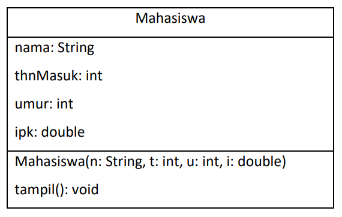</center>
<center>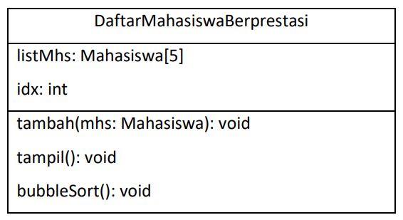</center>

#### Hasil Percobaan

- Output yang diharapkan untuk percobaan 1<br>
    <center>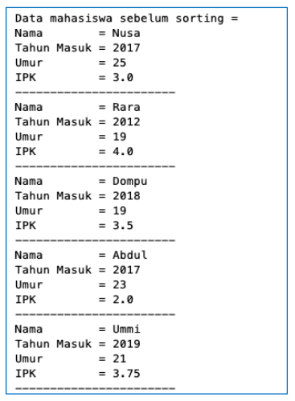</center>
    <center>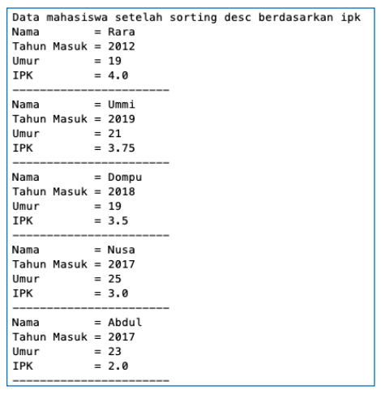</center>
- Output yang berhasil dibuat untuk percobaan 1<br>
    <center>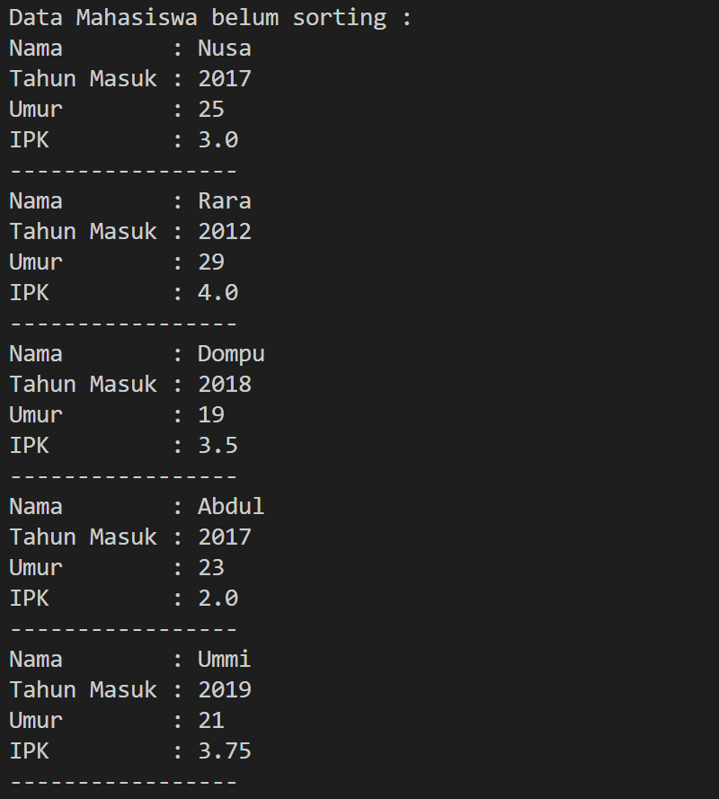</center>
    <center>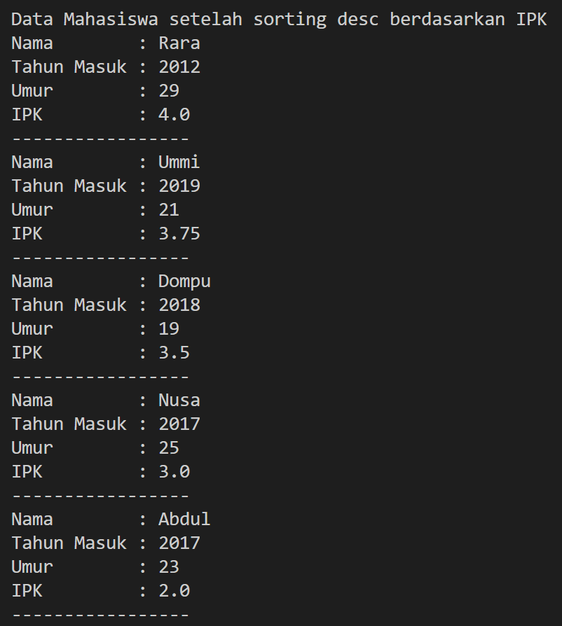</center>

---
- Pertanyaan: <br>
    1. Terdapat di method apakah proses bubble sort?<br>
    2. Di dalam method bubbleSort(), terdapat baris program seperti di bawah ini:<br>
    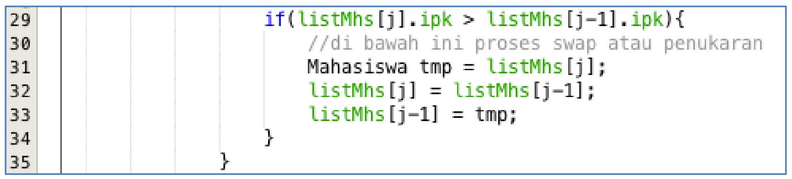<br>
    Untuk apakah proses tersebut?<br>
    3. Perhatikan perulangan di dalam bubbleSort() di bawah ini:<br>
    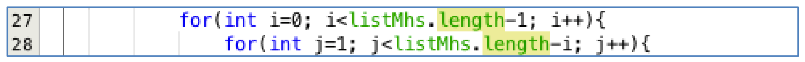<br>
       *   Apakah perbedaan antara kegunaan perulangan i dan perulangan j? 
       *   Mengapa syarat dari perulangan i adalah i<listMhs.length-1 ?
       *   Mengapa syarat dari perulangan j adalah j<listMhs.length-i ?
       *   Jika banyak data di dalam listMhs adalah 50, maka berapakali perulangan i akan berlangsung? Dan ada berapa Tahap bubble sort yang ditempuh<br>


- Jawaban: <br>
    1. proses bubble sort terjadi di method `bubbleSort()`<br>
    2. Baris program tersebut digunakna untuk melakukan pengecekan apakah `listMhs[j].ipk` lebih besar dari `listMhs[j-1].ipk` dan jika iya akan melakukan swap atau pertukaran data dengan terlebih dahulu meletakkan data `listMhs[j]` ke `temp` <br>
    3. * perulangan `j` digunakan untuk menswap data tiap langkah, sedangkah perulangan `i` digunakan untuk swap data tiap tahapan. Perulangan ini akan dikerjakan setelah menukaran data pada perulangan `j` telah dikerjakan
        * karena pada setiap perulangan, elemen terakhir sudah pasti berada pada posisi yang benar. Oleh karena itu, tidak perlu dilakukan perulangan lebih lanjut.
        * karena setiap perulangan i, elemen terakhir sudah berada pada posisi yang benar. Jadi tidak perlu dilanjutkan
        * Program akan melakukan perulangan i sebanyak 49 kali, karena tiap perulangan i akan menggeserkan satu elemen terbesar
        <br>
        
    

### Percobaan 2 :

- Output yang diharapkan untuk percobaan 2<br>
    <center>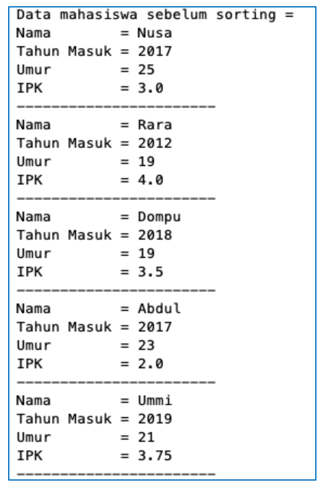</center>
    <center>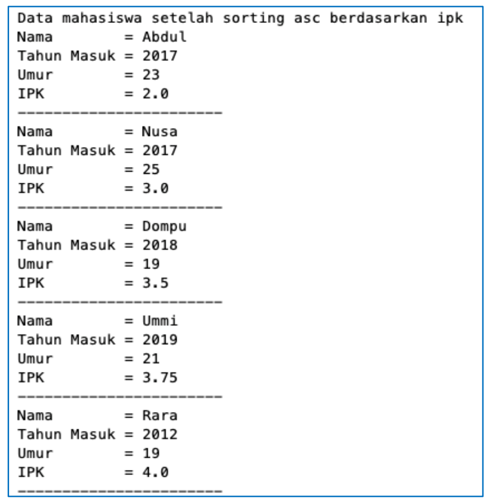</center>
- Output yang berhasil dibuat untuk percobaan 2<br>
    <center></center>

  <center>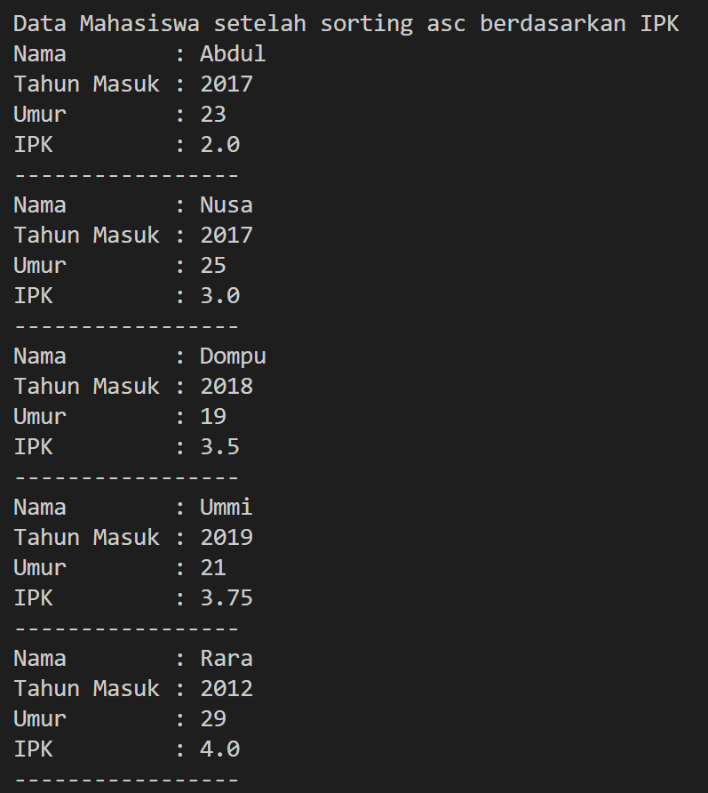</center>

- Pertanyaan: <br>
    1.	Di dalam method selection sort, terdapat baris program seperti di bawah ini:<br>

    <center>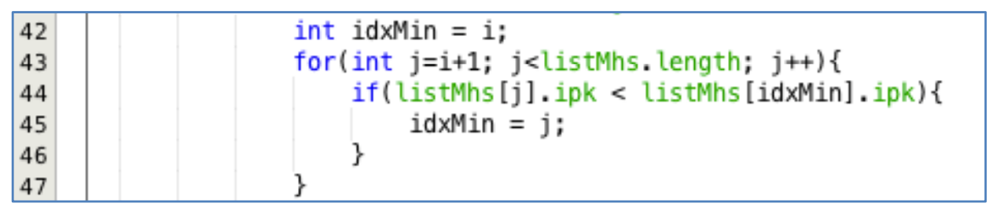</center>

    Untuk apakah proses tersebut, jelaskan!
    <br>


- Jawaban: <br>
    1. `int idxMin = i` Digunakna untuk inisiasi nilai awal idxMin adalah i <br>
    `for (int j = i + 1; j < listMhs.length; j++) {` Digunakan untuk melakukan perulangan kedua (j) mulai dari `j = i + 1` hingga `j < listMhs.length`<br>
    `if (listMhs[j].ipk < listMhs[idxMin].ipk) { idxMin = j; }` Baris tersebut digunakan untuk melakukan pengecekan apakah data pada `listMhs[j].ipk` lebih kecil dari data pada `listMhs[idxMin].ipk` jika benar akan memasukkan nilai j ke idxMin<br>


### Percobaan 3 :

- Output yang diharapkan untuk percobaan 2<br>
    <center></center>
    <center>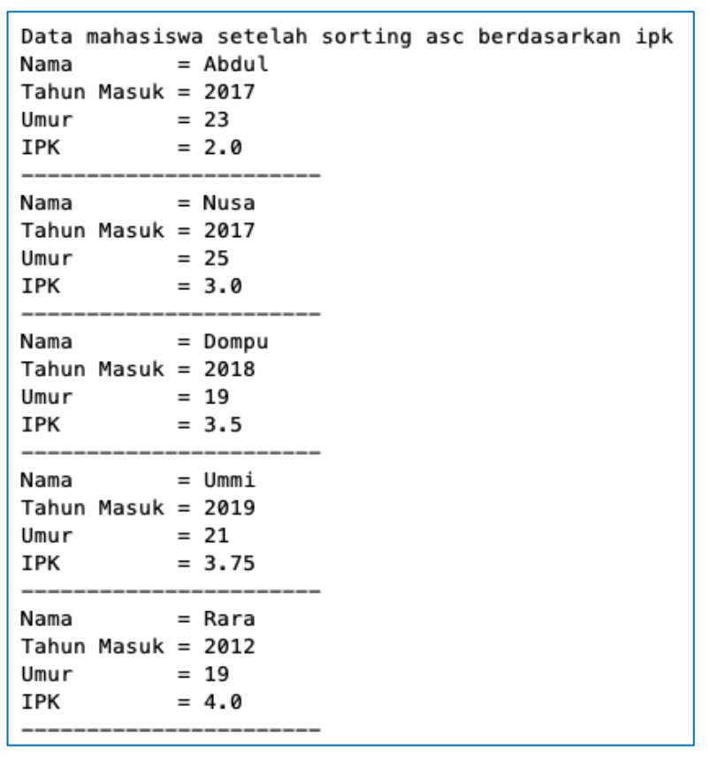</center>
- Output yang berhasil dibuat untuk percobaan 2<br>
    <center></center>
    <center></center>
---
- Pertanyaan: <br>
    1.	 Ubahlah fungsi pada InsertionSort sehingga fungsi ini dapat melaksanakan proses sorting dengan cara descending.<br>


- Jawaban: <br>
    1. 
    ```
    void insertionSortDes() {
        for (int i = 1; i < listMhs.length; i++) {
            Mahasiswa temp = listMhs[i];
            int j = i;
            while (j > 0 && listMhs[j - 1].ipk < temp.ipk) {
                listMhs[j] = listMhs[j - 1];
                j--;
            }
            listMhs[j] = temp;
        }
    }
    ```
    <br>
    Hasil output setelah modifikasi:

    <center>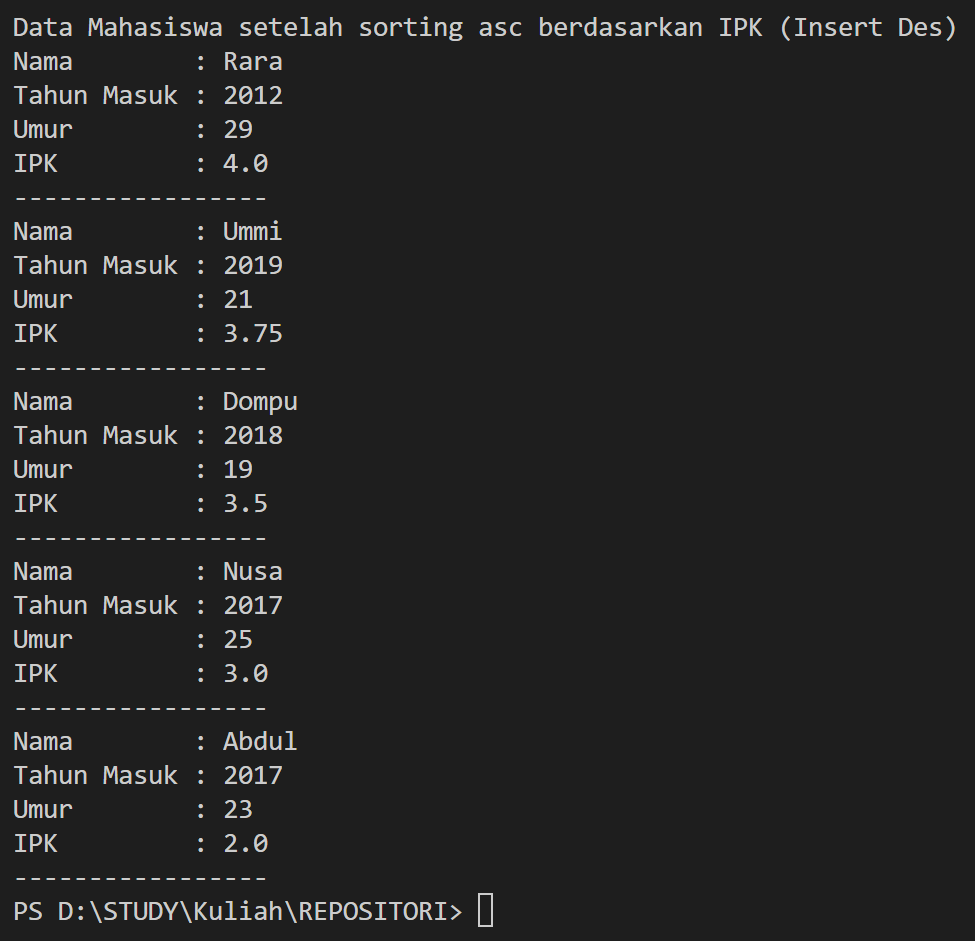


## PRAKTIKUM 
### Latihan  :
- Soal<br>
    Sebuah platform travel yang menyediakan layanan pemesanan kebutuhan travelling sedang mengembangkan backend untuk sistem pemesanan/reservasi akomodasi (penginapan), salah satu fiturnya adalah menampilkan daftar penginapan yang tersedia berdasarkan pilihan filter yang diinginkan user. Daftar penginapan ini harus dapat disorting berdasarkan 
    1. Harga dimulai dari harga termurah ke harga tertinggi. 
    2. Rating bintang penginapan dari bintang tertinggi (5) ke terendah (1) 
    Buatlah proses sorting data untuk kedua filter tersebut dengan menggunakan algoritma bubble sort dan selection sort.
    <center>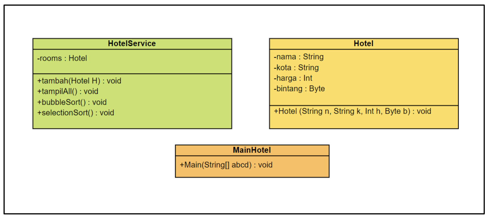<br></center>


- Hasil Output<br>
  
  1. Tampilan awal (Menu Utama): <br>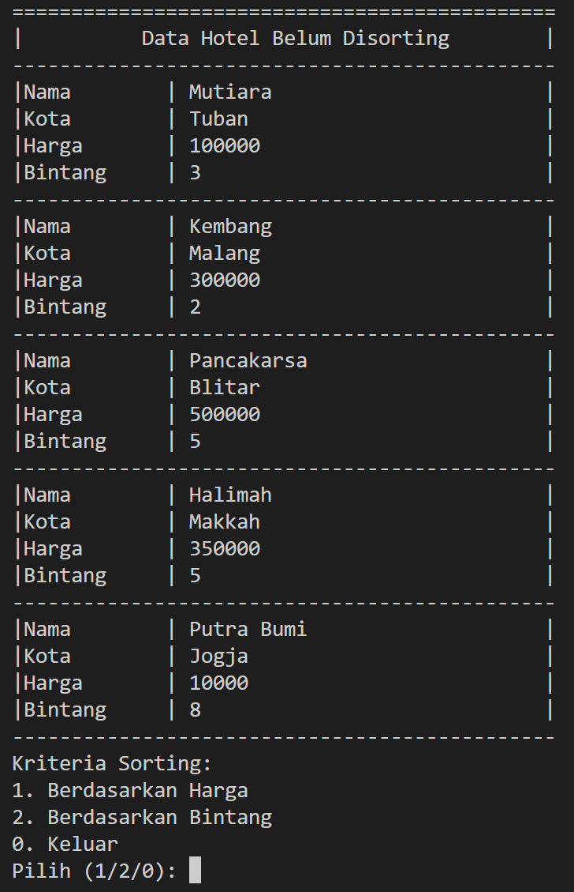<br></center>
  2. Tampilan Sorting Berdasarkan HARGA (BUBBLE SORT): <br>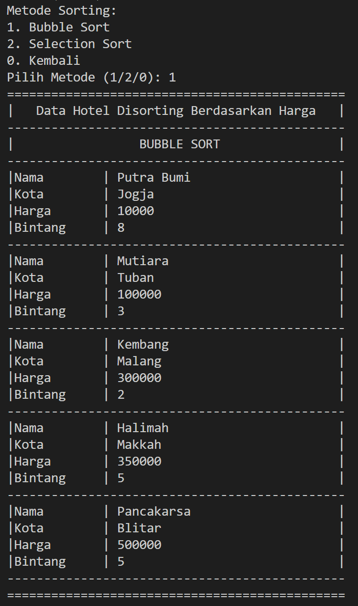<br></center>
  3. Tampilan Sorting Berdasarkan HARGA (SELECTION SORT): <br>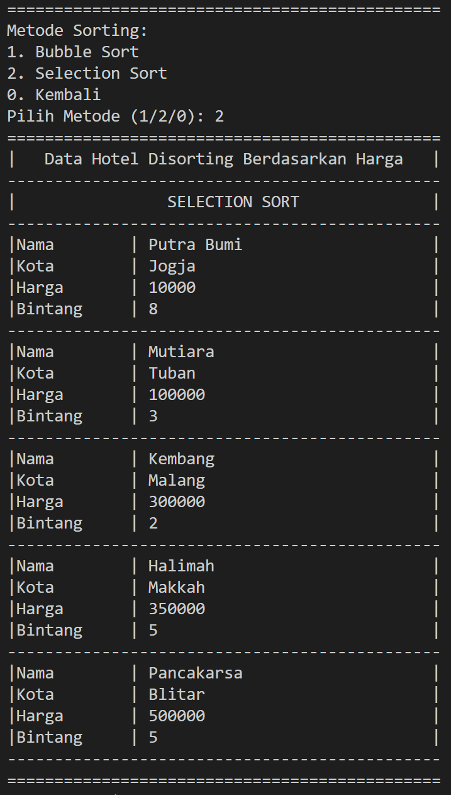<br></center>
  4. Tampilan Sorting Berdasarkan BINTANG (BUBBLE SORT): <br>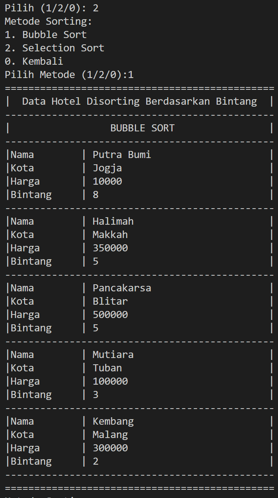<br></center>
  5. Tampilan Sorting Berdasarkan BINTANG (SELECTION SORT): <br>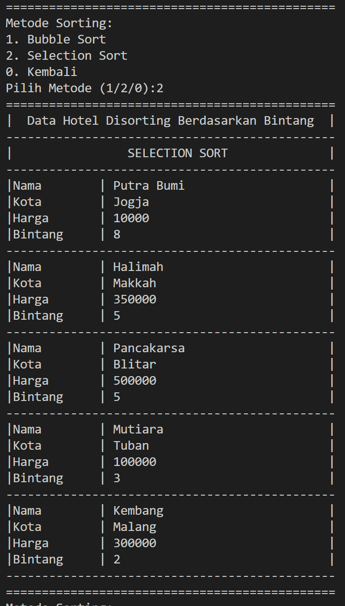<br></center>
  6. Tampilan kembali ke menu utama: <br>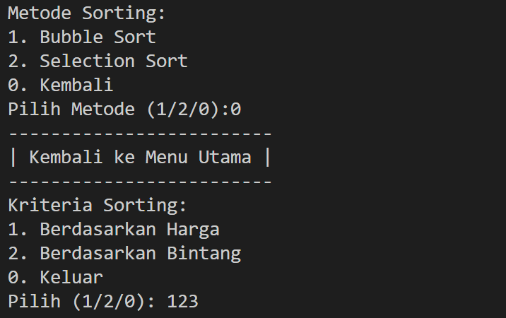<br></center>
  7. Tampilan Saat Inputan Salah: <br>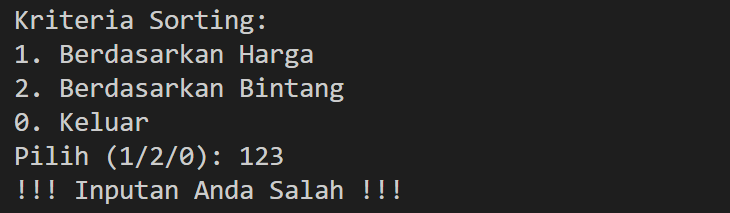<br></center>
  8. Tampilan Saat Keluar Program: <br>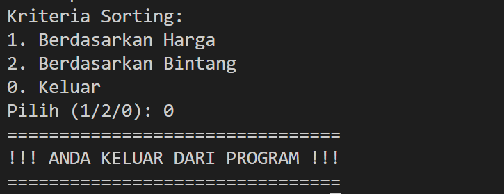<br></center>

