# Laporan Praktikum Pertemuan 7

<b>NAMA : GHETSA RAMADHANI RISKA ARRYANTI</b> 
<b>KELAS : TI-1H</b> 
<b>NIM : 2341720004</b> 
<b>ABSEN : 12</b> 

## 1.	Praktikum
### Percobaan 1 : Searching / Pencarian Menggunakan Agoritma Sequential Search

Perhatikan diagram class Buku di bawah ini! Diagram class ini yang selanjutnya akan dibuat 
sebagai acuan dalam membuat kode program class Buku dan PencarianBuku berikut ini.
 
 

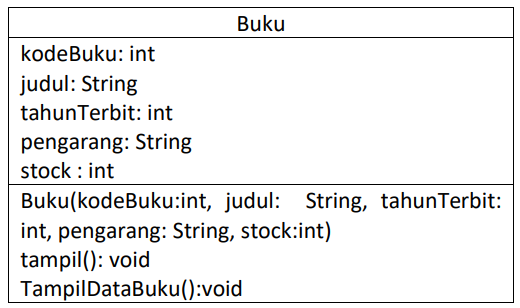

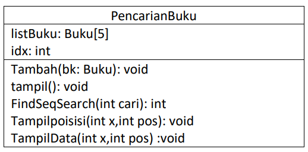

#### Hasil Percobaan

- Output yang diharapkan untuk percobaan 1 
    
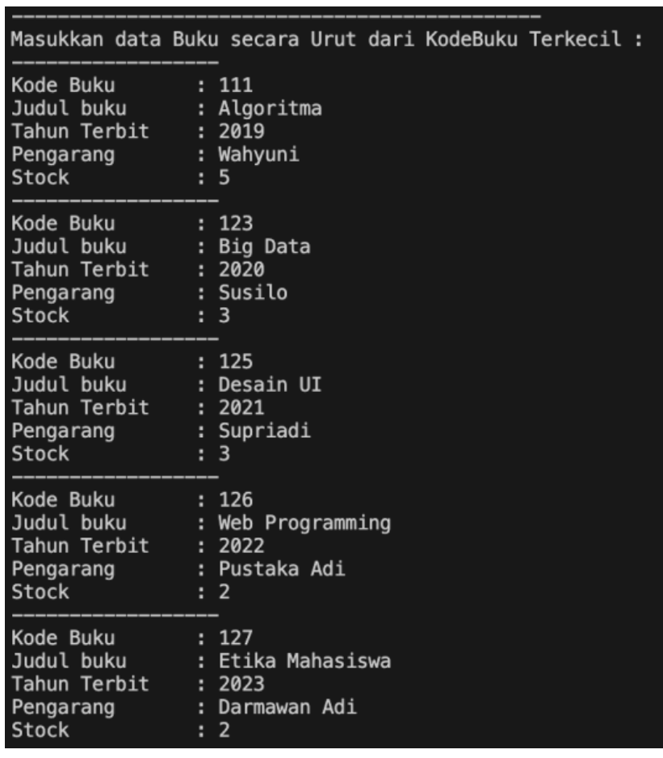

    
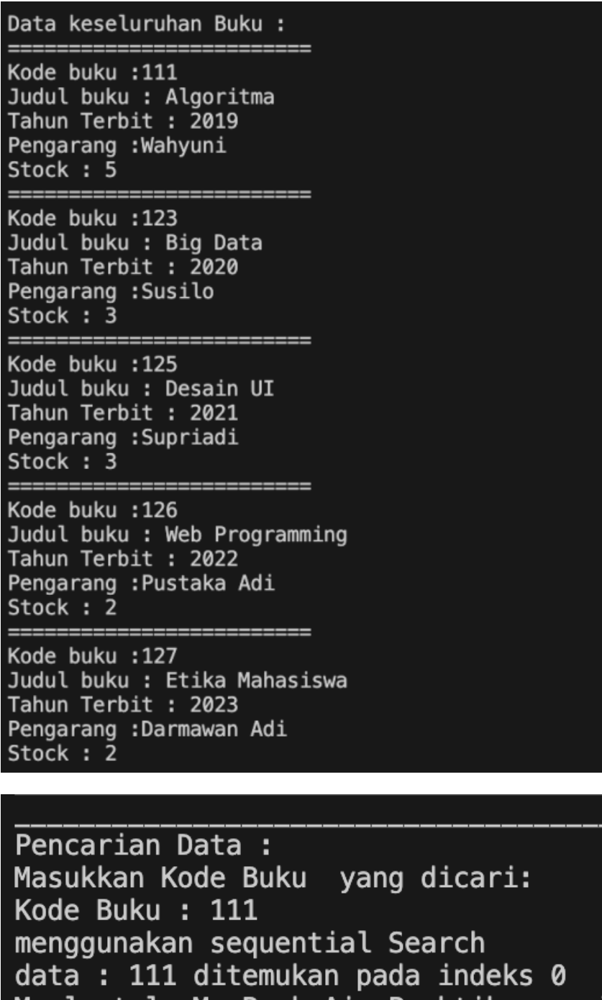

    
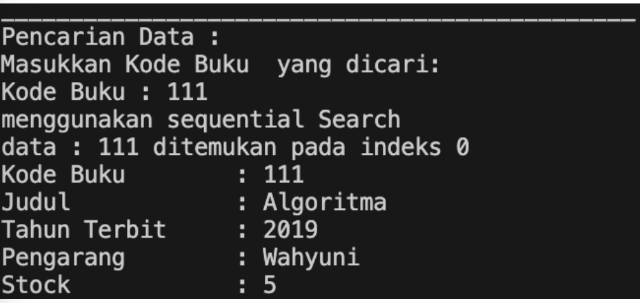

    
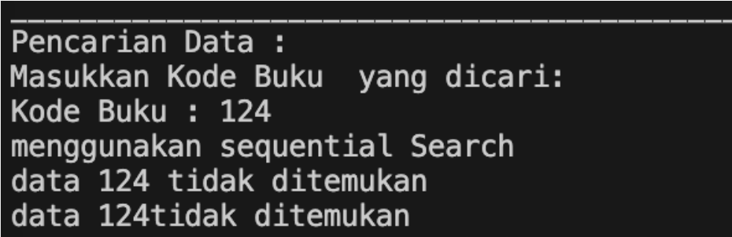

- Output yang berhasil dibuat untuk percobaan 1 
    
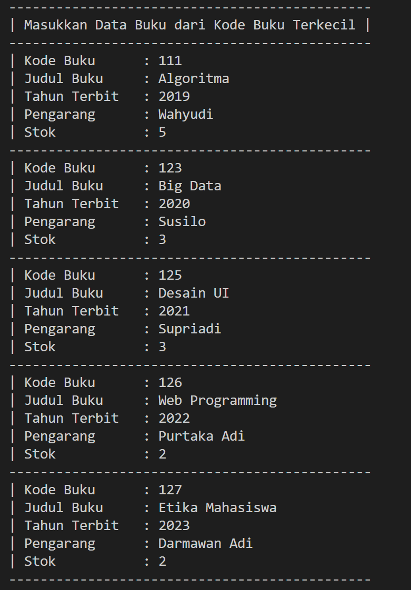

    
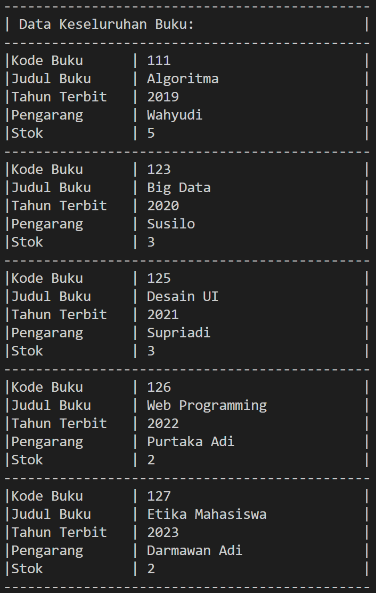

    Data Ditemukan

    
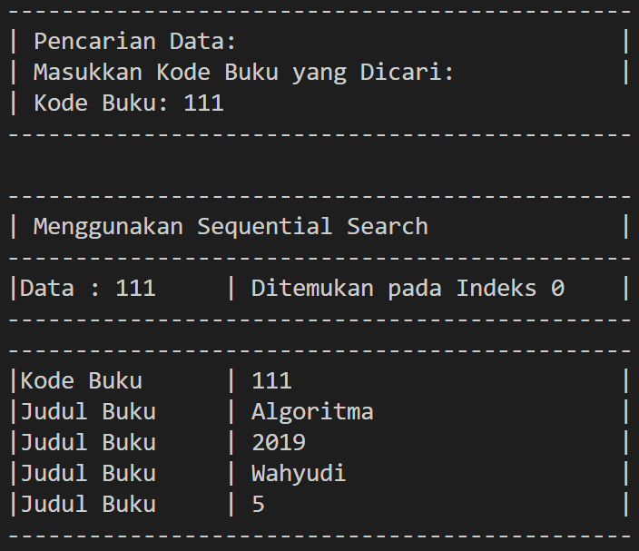

    
    Data Tidak Ditemukan 

    
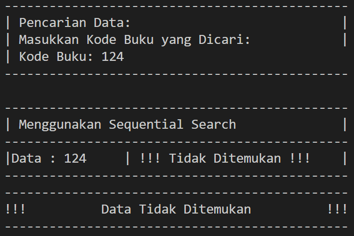

---
- Pertanyaan:  
    1. Jelaskan fungsi break yang ada pada method FindSeqSearch! 
    2. Jika Data Kode Buku yang dimasukkan tidak terurut dari kecil ke besar. Apakah program masih dapat berjalan? Apakah hasil yang dikeluarkan benar? Tunjukkan hasil screenshoot untuk bukti dengan kode Buku yang acak. Jelaskan Mengapa hal tersebut bisa terjadi? 
    3. Buat method baru dengan nama FindBuku menggunakan konsep sequential search dengan tipe method dari FindBuku adalah BukuNoAbsen. Sehingga Anda bisa memanggil method tersebut pada class BukuMain seperti gambar berikut : 
    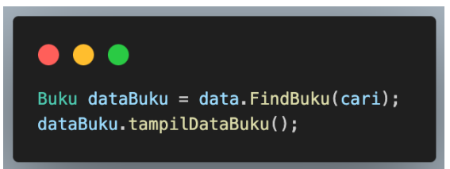 
       

- Jawaban:  
    1. `break` digunakan untuk menghentikan perulangan saat kondisi `(listBk[i] != null && listBk[i].kodeBuku == cari` terpenuhi 
    2. Program akan tetap berjalan karena searching dilakukan dengan metode Sequential Search, jadi data tidak perlu diurutkan terlebih dahulu untuk melakukan searching 
        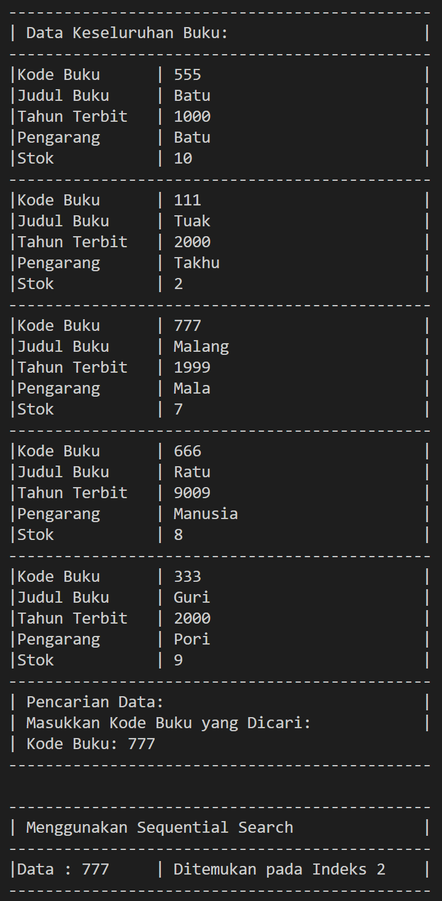 
    3.  
        
    

### Percobaan 2 :

- Output yang diharapkan untuk percobaan 2 
    

- Output yang berhasil dibuat untuk percobaan 2 
    

    

- Pertanyaan:  
    1.	Tunjukkan pada kode program yang mana proses divide dijalankan! 
    2.	Tunjukkan pada kode program yang mana proses conquer dijalankan! 
    3.	 Jika data Kode Buku yang dimasukkan tidak urut. Apakah program masih dapat berjalan? Mengapa demikian! Tunjukkan hasil screenshoot untuk bukti dengan kode Buku yang acak. Jelaskan Mengapa hal tersebut bisa terjadi? 
    4.	Jika Kode Buku yang dimasukkan dari Kode Buku terbesar ke terkecil (missal : 20215, 20214, 20212, 20211, 20210) dan elemen yang dicari adalah 20210. Bagaimana hasil dari binary search? Apakah sesuai? Jika tidak sesuai maka ubahlah kode program binary seach agar hasilnya sesuai! 

- Jawaban:  
    1.  
    2.  
    3.  
    4.  

### Percobaan 3 :

- Output yang diharapkan untuk percobaan 2 
    

    

- Output yang berhasil dibuat untuk percobaan 2 
    

    

## PRAKTIKUM 
### Latihan  :
- Soal 
    1. Modifikasi percobaan searching diatas dengan ketentuan berikut ini
        - Ubah tipe data dari kode Buku yang awalnya int menjadi String
        - Tambahkan method untuk pencarian kode Buku (bertipe data String) dengan menggunakan sequential search dan binary search.
    2. Modifikasi percobaan searching diatas dengan ketentuan berikut ini Algoritma dan Struktur Data 2023-2024 Tim Ajar Algoritma dan Struktur Data 2023-2024 Jurusan Teknologi Informasi-Politeknik Negeri Malang
       - Tambahkan method pencarian judul buku menggunakan sequential search dan binary search. Sebelum dilakukan searching dengan binary search data harus dilakukan pengurutan dengan menggunakan algoritma Sorting (bebas pilih algoritma sorting apapun)! Sehingga ketika input data acak, maka algoritma searching akan tetap berjalan
       - Buat aturan untuk mendeteksi hasil pencarian judul buku yang lebih dari 1 hasil dalam bentuk kalimat peringatan! Pastikan algoritma yang diterapkan sesuai dengan kasus yang diberikan

- Hasil Output 
  
  1. OUTPUT LATIHAN PRAKTIKUM NO.1:   

  
  2. OUTPUT LATIHAN PRAKTIKUM NO.2:   
