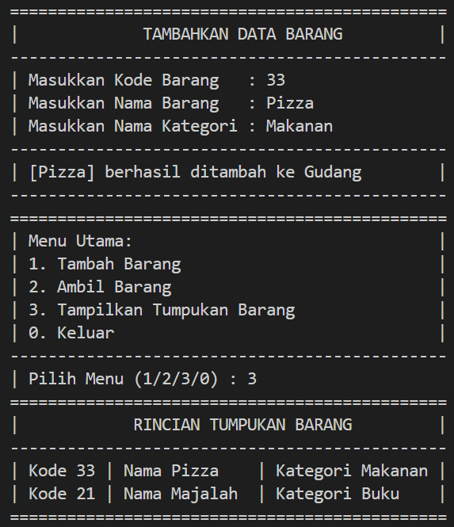

# Laporan Praktikum

<b>NAMA : GHETSA RAMADHANI RISKA ARRYANTI</b><br>
<b>KELAS : TI-1H</b><br>
<b>NIM : 2341720004</b><br>
<b>ABSEN : 12</b><br>

## 1.	Praktikum
### Percobaan 1: Penyimpanan Tumpukan Barang dalam Gudang

#### Hasil Percobaan

- Output yang diharapkan untuk percobaan 1<br>
    <center></center>
    <center></center>
    
- Output yang berhasil dibuat untuk percobaan 1<br>
    <center></center>
    <center></center>

---
#### Pertanyaan & Jawaban
- Pertanyaan: <br>
    1. Lakukan perbaikan pada kode program, sehingga keluaran yang dihasilkan sama dengan verifikasi hasil percobaan! Bagian mana saja yang perlu diperbaiki?<br>
    2. Berapa banyak data barang yang dapat ditampung di dalam tumpukan? Tunjukkan potongan kode programnya!<br>
    3. Mengapa perlu pengecekan kondisi !cekKosong() pada method tampilkanBarang? Kalau kondisi tersebut dihapus, apa dampaknya?<br>
    4. Modifikasi kode program pada class Utama sehingga pengguna juga dapat memilih operasi lihat barang teratas, serta dapat secara bebas menentukan kapasitas gudang!<br>
    5. Commit dan push kode program ke Github<br>
       


- Jawaban: <br>
    1. Bagian yang perlu diperbaiki terletak di method `lihatBarangTeratas()` lebih tepatnya pada kondisi `if`<br>
        ```
        public Barang12 lihatBarangTeratas() {
            System.out.println("==============================================");
            System.out.println("|                BARANG TERATAS              |");
            System.out.println("----------------------------------------------");
            if (!cekKosong()) {
                Barang12 barangTeratas = tumpukan[top];
                System.out.printf("|%-43s %s|%n", " Kode       | " + barangTeratas.kode, "");
                System.out.printf("|%-43s %s|%n", " Nama       | " + barangTeratas.nama, "");
                System.out.printf("|%-43s %s|%n", " Kategori   | " + barangTeratas.kategori, "");
                System.out.println("==============================================");
                return barangTeratas;
            } else {
                System.out.println("         !!! TUMPUKAN BARANG KOSONG !!!       ");
                System.out.println("==============================================");
                return null;
            }
        }
        ```
    2. Banyak data barang yang dapay ditampung sebanyak 7, yang terdapat pada kode:
    ```
    Gudang12 gudang = new Gudang12(7);
    ```
    3. Pengecekan kondisi `!cekKosong()` diperlukan untuk memastikan bahwa tumpukan barang tidak kosong. Jika kondisi tersebut dihapus, program akan tetap dijalankan namun dapat menyebabkan hasil yang tidak relevan atau bahkan error saat mencoba menampilkan array kosong, sehingga menyebabkan `NullPointerException`.
    4. Hasil Modifikasi<br>
    <br>
   <br>
   
    

### Percobaan 2 : Konversi Kode Barang ke Biner
#### Hasil Percobaan
- Output yang diharapkan untuk percobaan 2<br>
    <center></center>
- Output yang berhasil dibuat untuk percobaan 2<br>
    <center></center>


#### Pertanyaan & Jawaban
- Pertanyaan: <br>
    1.	Pada method `konversiDesimalKeBiner`, ubah kondisi perulangan menjadi `while (kode != 0)`, bagaimana hasilnya? Jelaskan alasannya!<br>
    2.	Jelaskan alur kerja dari method konversiDesimalKeBiner!<br>


- Jawaban: <br>
    1. Tidak akan terdapat perubahan karena hasilnya akan tetap sama karena pembagian bilangan desimal oleh 2 dilakukan terus hingga sisa pembagian menjadi 0.<br> 
    2. 
       1. Membuat objek untuk menampung sisa pembagian
   
       2. Jika kode tidak sama dengan 0, akan melakukan:
          - Memasukkan sisa pembagian ke dalam stack
          - Membagi bilangan desimal `kode` dengan 2 untuk mendapatkan nilai baru
          - Membuat string `biner` untuk menyimpan hasil konversi

       3. Buat string biner untuk menyimpan hasil konversi.
       
       4. Selama stack tidak kosong, maka akan melakukan:
          - Mengambil sisa pembagian dari stack
          - Menambahkan sisa bagi ke string `biner`
       
       5. Mereturn nilai string `biner` yang telah berisi representasi bilangan biner dari bilangan desimal kode


### Percobaan 3: Konversi Notasi Infix ke Postfix

#### Hasil Percobaan
- Output yang diharapkan untuk percobaan 3<br>
    <center></center>
- Output yang berhasil dibuat untuk percobaan 3<br>
    <center></center>


#### Pertanyaan & Jawaban
- Pertanyaan: <br>
    1.	Pada method derajat, mengapa return value beberapa case bernilai sama? Apabila return value diubah dengan nilai berbeda-beda setiap case-nya, apa yang terjadi?<br>
    2.	Jelaskan alur kerja method konversi!<br>
    3.	Pada method konversi, apa fungsi dari potongan kode berikut? <br>
    `c = Q.charAt`<br>


- Jawaban: <br>
    1. Ada beberapa return value yang sama karena beberapa operator matematika memiliki prioritas yang sama, dan jika return value tersebut diubah, akan mempengaruhi dapat menyebabkan hasil tidak sesuai dengan postfix yang benar<br> 
    2. 
       1. Membuat string kosong `p` untuk menyimpan hasil konversi postfix.
   
       2. Melakukan perulangan infix `Q`

       3. Melakukan pengecekan terhadap `c`:
          - Jika c adalah operand, tambahkan karakter c ke dalam string p.
          - Jika c adalah `(`, akan push/memasukkan ke String `p`.
          - Jika c adalah `)`, karakter dalam stack sampai tanda kurung buka`(` akan di-`pop` / dikeluarkan ke string `p` 
          - Jika c adalah operator, akan mem-`pop` operator dari stack yang memiliki derajat prioritas lebih tinggi/sama hingga tanda kurung buka`(` di temukan. Kemudian menambahkan operator-operator tersebut ke dalam String `p`, kemudian yang terakhir menambahkan operator `c` ke dalam stack
       
       4. Me-return nilai String `p` yang berisikan postfix.

    3. `c = Q.charAt(i)` berfungsi untuk mengambil karakter pada indeks ke-`i` dari string `Q`


## PRAKTIKUM 
### Latihan  :
- Soal<br>
    Perhatikan dan gunakan kembali kode program pada Percobaan 1. Tambahkan dua method berikut pada class Gudang:

    - Method lihatBarangTerbawah digunakan untuk mengecek barang pada tumpukan terbawah

    - Method cariBarang digunakan untuk mencari ada atau tidaknya barang berdasarkan kode barangnya atau nama barangnya


- Hasil Output<br>
  
  1. OUTPUT LATIHAN PRAKTIKUM:
     - Manampilkan data barang terbawah
        <center></center>

     - Mencari data barang menggunakan Kode Barang
        <center></center>

     - Mencari data barang menggunakan Nama Barang
        <center></center>
        