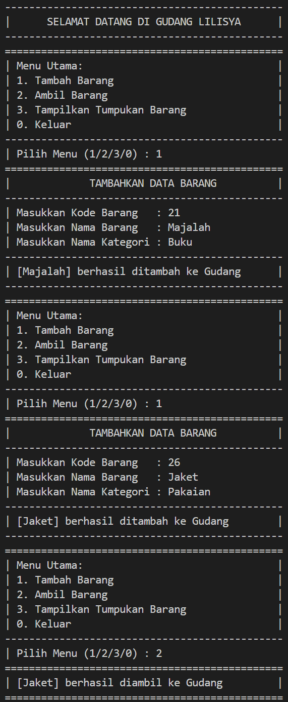

# Laporan Praktikum

<b>NAMA : GHETSA RAMADHANI RISKA ARRYANTI</b><br>
<b>KELAS : TI-1H</b><br>
<b>NIM : 2341720004</b><br>
<b>ABSEN : 12</b><br>

## 1.	Praktikum
### Percobaan 1: Penyimpanan Tumpukan Barang dalam Gudang

#### Hasil Percobaan

- Output yang diharapkan untuk percobaan 1<br>
    <center></center>
    <center></center>
    
- Output yang berhasil dibuat untuk percobaan 1<br>
    <center></center>
    <center></center>

---
#### Pertanyaan & Jawaban
- Pertanyaan: <br>
    1. Lakukan perbaikan pada kode program, sehingga keluaran yang dihasilkan sama dengan verifikasi hasil percobaan! Bagian mana saja yang perlu diperbaiki?<br>
    2. Berapa banyak data barang yang dapat ditampung di dalam tumpukan? Tunjukkan potongan kode programnya!<br>
    3. Mengapa perlu pengecekan kondisi !cekKosong() pada method tampilkanBarang? Kalau kondisi tersebut dihapus, apa dampaknya?<br>
    4. Modifikasi kode program pada class Utama sehingga pengguna juga dapat memilih operasi lihat barang teratas, serta dapat secara bebas menentukan kapasitas gudang!<br>
    5. Commit dan push kode program ke Github<br>
       


- Jawaban: <br>
    1. Bagian yang perlu diperbaiki terletak di method `lihatBarangTeratas()` lebih tepatnya pada kondisi `if`<br>
        ```
        public Barang12 lihatBarangTeratas() {
            System.out.println("==============================================");
            System.out.println("|                BARANG TERATAS              |");
            System.out.println("----------------------------------------------");
            if (!cekKosong()) {
                Barang12 barangTeratas = tumpukan[top];
                System.out.printf("|%-43s %s|%n", " Kode       | " + barangTeratas.kode, "");
                System.out.printf("|%-43s %s|%n", " Nama       | " + barangTeratas.nama, "");
                System.out.printf("|%-43s %s|%n", " Kategori   | " + barangTeratas.kategori, "");
                System.out.println("==============================================");
                return barangTeratas;
            } else {
                System.out.println("         !!! TUMPUKAN BARANG KOSONG !!!       ");
                System.out.println("==============================================");
                return null;
            }
        }
        ```
    2. Banyak data barang yang dapay ditampung sebanyak 7, yang terdapat pada kode:
    ```
    Gudang12 gudang = new Gudang12(7);
    ```
    3. Pengecekan kondisi `!cekKosong()` diperlukan untuk memastikan bahwa tumpukan barang tidak kosong. Jika kondisi tersebut dihapus, program akan tetap dijalankan namun dapat menyebabkan hasil yang tidak relevan atau bahkan error saat mencoba menampilkan array kosong, sehingga menyebabkan `NullPointerException`.
    4. Hasil Modifikasi
    <br>
   <br>
   
    

### Percobaan 2 : Konversi Kode Barang ke Biner
#### Hasil Percobaan
- Output yang diharapkan untuk percobaan 2<br>
    <center></center>
- Output yang berhasil dibuat untuk percobaan 2<br>
    <center></center>


#### Pertanyaan & Jawaban
- Pertanyaan: <br>
    1.	Pada method `konversiDesimalKeBiner`, ubah kondisi perulangan menjadi `while (kode != 0)`, bagaimana hasilnya? Jelaskan alasannya!<br>
    2.	Jelaskan alur kerja dari method konversiDesimalKeBiner!<br>


- Jawaban: <br>
    1. <br> 


### Percobaan 3: Konversi Notasi Infix ke Postfix

#### Hasil Percobaan
- Output yang diharapkan untuk percobaan 3<br>
    <center></center>
- Output yang berhasil dibuat untuk percobaan 3<br>
    <center></center>


#### Pertanyaan & Jawaban
- Pertanyaan: <br>
    1.	Pada method derajat, mengapa return value beberapa case bernilai sama? Apabila return value diubah dengan nilai berbeda-beda setiap case-nya, apa yang terjadi?<br>
    2.	Jelaskan alur kerja method konversi!<br>
    3.	Pada method konversi, apa fungsi dari potongan kode berikut? <br>
    `c = Q.charAt`<br>


- Jawaban: <br>
    1. <br> 


## PRAKTIKUM 
### Latihan  :
- Soal<br>
    Perhatikan dan gunakan kembali kode program pada Percobaan 1. Tambahkan dua method berikut pada class Gudang:

    - Method lihatBarangTerbawah digunakan untuk mengecek barang pada tumpukan terbawah

    - Method cariBarang digunakan untuk mencari ada atau tidaknya barang berdasarkan kode barangnya atau nama barangnya


- Hasil Output<br>
  
  1. OUTPUT LATIHAN PRAKTIKUM NO.1: <br>
     1. Tampilan Saat Input Data Buku <br> <center><br></center>
     2. Tampilan Keseluruhan Data Buku<br><center><br></center>
     3. Tampilan Menu Utama <br><center><br></center>
     4. Tampilan Pencarian Kode Buku <br><center><br></center>
        - Menggunakan Sequential Search <br>
          - Data Ditemukan <br><center></center>
          - Data Tidak Ditemukan <br><center><br></center>
        - Menggunakan Binary Search <br>
          - Data Ditemukan <br><center></center>
          - Data Tidak Ditemukan <br><center></center>
     5. Tampilan Saat Inputan Salah <br><center><br></center>
     6. Tampilan Saat Kembali Ke Menu Utama <br><center><br></center>
     7. Tampilan Saat Keluar Program <br><center><br></center>
    
  2. OUTPUT LATIHAN PRAKTIKUM NO.2: <br>
     1. Tampilan Saat Input Data Buku<br> <center><br></center>
     2. Tampilan Keseluruan Data Buku<br><center><br></center>
     3. Tampilan Menu Utama <br><center><br></center>
     4. Tampilan Pencarian Kode Buku 
        - Menggunakan Sequential Search <br>
          - Data Ditemukan <br><center></center>
          - Data Tidak Ditemukan <br><center><br></center>
        - Menggunakan Binary Search <br>
          - Data Ditemukan <br><center></center><br><center><br></center>
          - Data Tidak Ditemukan <br><center></center>
     5. Tampilan Pencarian Judul Buku
        - Menggunakan Sequential Search <br>
          - Data Ditemukan <br><center></center>
          - Data Tidak Ditemukan <br><center><br></center>
        - Menggunakan Binary Search <br>
          - Data Ditemukan <br><center></center><br><center><br></center>
          - Data Tidak Ditemukan <br><center>
     6. Tampilan Saat Inputan Salah <br><center><br></center>
     7. Tampilan Saat Kembali Ke Menu Utama <br><center><br></center>
     8. Tampilan Saat Keluar Program <br><center><br></center>  
