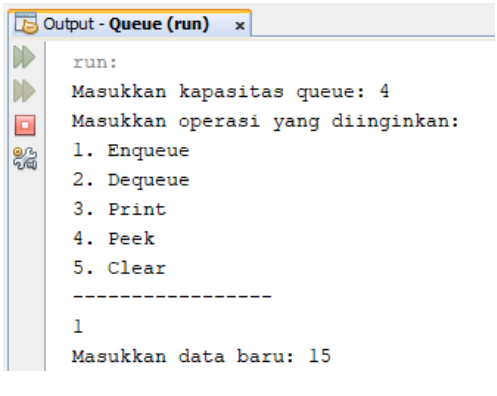
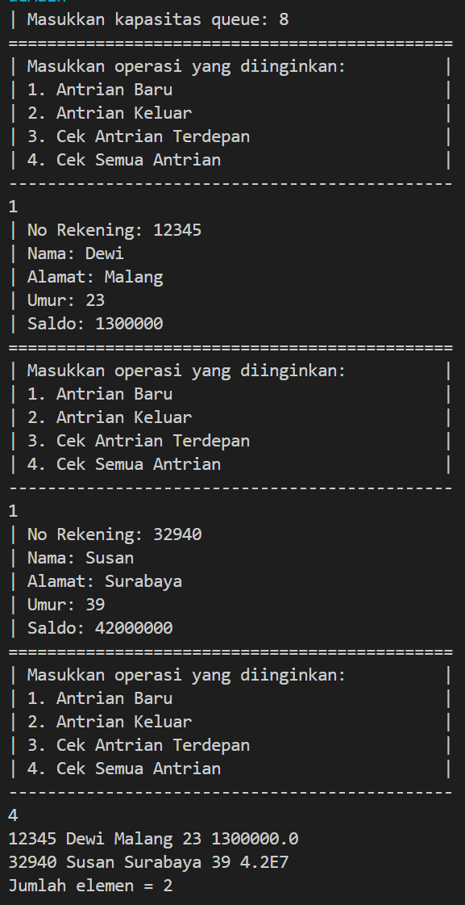
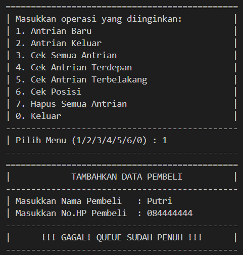
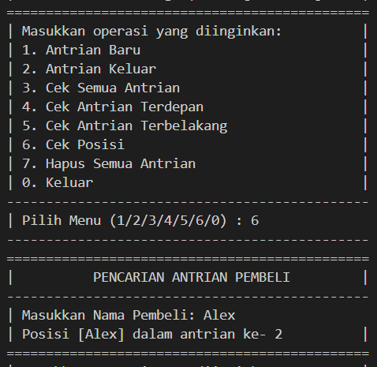

# Laporan Praktikum Pertemuan 10
# QUEUE

<b>NAMA : GHETSA RAMADHANI RISKA ARRYANTI</b><br>
<b>KELAS : TI-1H</b><br>
<b>NIM : 2341720004</b><br>
<b>ABSEN : 12</b><br>

## 1.	Praktikum
### Percobaan 1:

#### Hasil Percobaan

- Output yang diharapkan untuk percobaan 1<br>
    <center></center>

    <center></center>
    
- Output yang berhasil dibuat untuk percobaan 1<br>
    <center></center>

---
#### Pertanyaan & Jawaban
- Pertanyaan: <br>
    1. Pada konstruktor, mengapa nilai awal atribut front dan rear bernilai -1, sementara atribut size bernilai 0?<br>
    2. Pada method Enqueue, jelaskan maksud dan kegunaan dari potongan kode berikut!<br> 
   
        ```
            if (rear == max - 1){
                rear = 0;
            }
        ```    
    3. Pada method Dequeue, jelaskan maksud dan kegunaan dari potongan kode berikut!<br>
        ```
            if (front == max - 1){
                front = 0;
            }
        ```     
    4. Pada method `print`, mengapa pada proses perulangan variabel i tidak dimulai dari 0 `(int i=0)`, melainkan `int i=front`?<br>
    5. Perhatikan kembali method print, jelaskan maksud dari potongan kode berikut! <br>`i = (i + 1) % max`
    6. Tunjukkan potongan kode program yang merupakan queue overflow!<br>
    7. Pada saat terjadi queue overflow dan queue underflow, program tersebut tetap dapat berjalan dan hanya menampilkan teks informasi. Lakukan modifikasi program sehingga pada saat terjadi queue overflow dan queue underflow, program dihentikan!<br>
       


- Jawaban: <br>
    1. Nilai awal atribut front dan rear adalah -1 karena dalam keadaan awal, antrian (queue) kosong, sementara size bernilai 0 karena belum ada elemen yang dimasukkan ke dalam antrian<br>
    2. Potongan kode tersebut bertujuan untuk melakukan penyesuaian posisi rear ke indeks awal (0) jika rear telah mencapai batas maksimum (max - 1) dari array circular yang digunakan sebagai implementasi dari antrian (queue).<br>
    3. Potongan kode tersebut bertujuan untuk melakukan penyesuaian posisi front ke indeks awal (0) jika front telah mencapai batas maksimum (max - 1) dari array circular yang digunakan sebagai implementasi dari antrian (queue).<br>
    4. Pada metode `print`, variabel `i` dimulai dari nilai `front` karena antrian dapat menggunakan struktur data circular, di mana elemen-elemen awal mungkin telah dikeluarkan dari antrian. Oleh karena itu, kita harus mulai mencetak dari elemen yang saat ini merupakan elemen terdepan dalam antrian, yaitu yang ditunjukkan oleh `front`.<br>
    5. Kode tersebut digunakan untuk memperbarui nilai `i`dengan menambahkannya dengan `1` kemudian di sisa bagi dengan `max`
    6. Kode program queue overflow:<br>
    ```
        public void enqueue(int dt) {
            if (isFull()) {
                System.out.println("Queue sudah penuh");
            } else {
                if (isEmpty()) {
                    front = rear = 0;
                } else {
                    if (rear == max - 1) {
                        rear = 0; 
                    } else {
                        rear++;
                    }
                }
                data[rear] = dt;
                size++;
            }
        }
    ```
    7. 
    ```
        public void enqueue(int dt) {
            if (isFull()) {
                System.out.println("Queue sudah penuh. Program dihentikan.");
                System.exit(0);
            } else {
                if (isEmpty()) {
                    front = rear = 0;
                } else {
                    if (rear == max - 1) {
                        rear = 0;
                    } else {
                        rear++;
                    }
                }
                data[rear] = dt;
                size++;
            }
        }

        public int dequeue() {
            int dt = 0;
            if (isEmpty()) {
                System.out.println("Queue masih kosong. Program dihentikan.");
                System.exit(0);
            } else {
                dt = data[front];
                size--;
                if (isEmpty()) {
                    front = rear = -1;
                } else {
                    if (front == max - 1) {
                        front = 0;
                    } else {
                        front++;
                    }
                }
            }
            return dt;
        }
    ```
    
    <br>
   
    
### Percobaan 2 : Konversi Kode Barang ke Biner
#### Hasil Percobaan
- Output yang diharapkan untuk percobaan 2<br>
    <center></center>
    
- Output yang berhasil dibuat untuk percobaan 2<br>
    <center></center>


#### Pertanyaan & Jawaban
- Pertanyaan: <br>
    1.	Pada class QueueMain, jelaskan fungsi IF pada potongan kode program berikut!<br>

    ```
    if (!"".equals(data.norek) && !"".equals(data.nama) && !"".equals(data.alamat) && data.umur != 0
            && data.saldo != 0) {
        System.out.println("| Antrian yang keluar: " + data.norek + " " + data.nama + " " + data.alamat
                + " " + data.umur + " " + data.saldo + "|");
        break;
    }
    ```
    2.	Lakukan modifikasi program dengan menambahkan method baru bernama peekRear pada class Queue yang digunakan untuk mengecek antrian yang berada di posisi belakang! Tambahkan pula daftar menu 5. Cek Antrian paling belakang pada class QueueMain sehingga method peekRear dapat dipanggil!<br>


- Jawaban: <br>
    1. Fungsi IF tersebut digunakan untuk memastikan bahwa data nasabah yang akan dikeluarkan dari antrian/queue tidak kosong dan memiliki nilai yang valid sebelum data tersebut di-print<br> 
    2. <center></center>


## LATIHAN 
### Tugas  :
- Soal<br>
    Buatlah program antrian untuk mengilustasikan pesanan disebuah warung. Ketika seorang pembeli akan mengantri, maka dia harus mendaftarkan nama, dan nomor HP seperti yang 
    digambarkan pada Class diagram berikut:

    <center></center>

    Class diagram Queue digambarkan sebagai berikut:

    <center></center>


    Keterangan:
      -  Method create(), isEmpty(), isFull(), enqueue(), dequeue() dan print(), kegunaannya sama seperti yang telah dibuat pada Praktikum
      -  Method peek(): digunakan untuk menampilkan data Pembeli yang berada di posisi antrian paling depan
      -  Method peekRear(): digunakan untuk menampilkan data Pembeli yang berada di posisi antrian paling belakang
      -  Method peekPosition(): digunakan untuk menampilkan seorang pembeli (berdasarkan nama) posisi antrian ke berapa
      -  Method daftarPembeli(): digunakan untuk menampilkan data seluruh pembeli


- Hasil Output<br>
  
  1. OUTPUT LATIHAN PRAKTIKUM:
     * Menentukan Kapasitas Queue & Menu Utama<br>
        <center></center>

     * Menambahkan Antrian Pembeli Baru<br>
       - Input Berhasil<br>
            <center></center>

       - Input Gagal<br>
            <center></center>

     * Menampilkan Daftar Antrian Pembeli<br>
        <center></center>

     * Menambahkan Mengeluarkan/Menghapus Antrian Pembeli Pertama<br>
        <center></center>

     * Menampilkan Antrian Pembeli Terdepan / Pertama<br>
        <center></center>

     * Menampilkan Antrian Pembeli Terbelakang / Terakhir<br>
        <center></center>

     * Mencari Pembeli Antrian Keberapa (Berdasarkan Nama)<br>
       - Nama Pembeli Ditemukan<br>
            <center></center>

       - Nama Pembeli Tidak Ditemukan<br>
            <center></center>

     * Menghapus Seluruh Antrian<br>
       - Menghapus Antrian<br>
            <center></center><br>

            <center></center>

       - Tidak Jadi Menghapus Antrian<br>
            <center></center>

     * Keluar Dari Program<br>
        <center></center>