# Laporan Praktikum Pertemuan 11
# LINKED LIST

<b>NAMA : GHETSA RAMADHANI RISKA ARRYANTI</b><br>
<b>KELAS : TI-1H</b><br>
<b>NIM : 2341720004</b><br>
<b>ABSEN : 12</b><br>

## 1.	Praktikum
### Percobaan 1: Pembuatan Single Linked List

#### Hasil Percobaan

- Output yang diharapkan untuk percobaan 1<br>
    <center>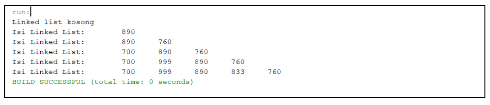</center>
    
- Output yang berhasil dibuat untuk percobaan 1<br>
    <center>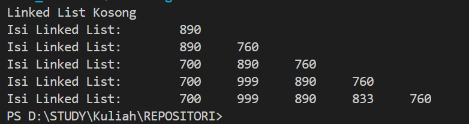</center>

---
#### Pertanyaan & Jawaban 1
- Pertanyaan: <br>
    1. Mengapa hasil compile kode program di baris pertama menghasilkan “Linked List Kosong”?<br>
    2. Jelaskan kegunaan variable temp secara umum pada setiap method!<br>
    3. Perhatikan class SingleLinkedList, pada method insertAt Jelaskan kegunaan kode berikut <br>
        ```
            if(temp.next.next==null) tail=temp.next;
        ```     
       

- Jawaban: <br>
    1. Karena belum ada yang ditambahkan pada List<br>
    2. `temp` digunakan untuk menunjukkan node sementara yang merupakan singkatan dari temporary<br>
    3. kode tersebut digunakan untuk mengecek apakah node yang akan ditambahkan merupakan node terakhir. Dan jika iya, tail akan diubah jadi node baru<br>
   
    
### Percobaan 2 : Konversi Kode Barang ke Biner
#### Hasil Percobaan
- Output yang diharapkan untuk percobaan 2<br>
    <center>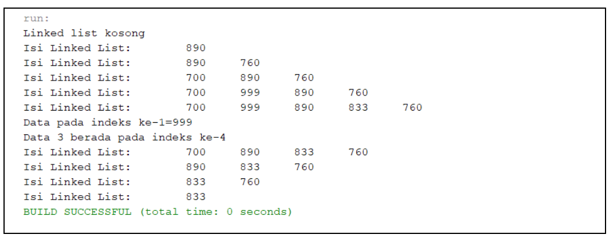</center>
    
- Output yang berhasil dibuat untuk percobaan 2<br>
    <center>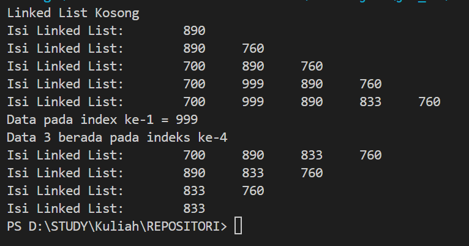</center>


#### Pertanyaan & Jawaban
- Pertanyaan: <br>
    1.	Mengapa digunakan keyword break pada fungsi remove? Jelaskan!<br>
    2.	Jelaskan kegunaan kode dibawah pada method remove<br>
        ```
        else if (temp.next.data == key){
            temp.next = temp.next.next;
        }
        ```


- Jawaban: <br>
    1. break digunakan untuk menghentikan kode setelah suatu kondisi terpenuhi<br> 
    2. Kode tersebut digunakan untuk menghapus node yang sesuai dengan key dengan melewatkan node yang ingin dihapus dan mengubah referensi node sebelumnya (temp) untuk menunjuk ke node setelah node yang dihapus.


## LATIHAN 
### Tugas  :
- Soal<br>

    1. Implementasikan ilustrasi Linked List Berikut. Gunakan 4 macam penambahan data yang telah dipelajari sebelumnya untuk menginputkan data.
        <center>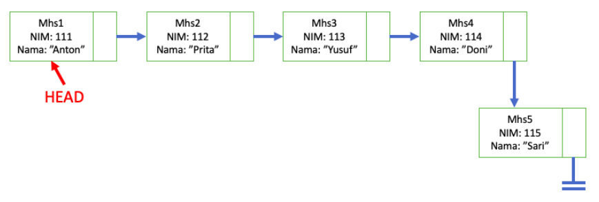</center>
    
    2. Buatlah implementasi program antrian layanan unit kemahasiswaan sesuai dengan kondisi yang ditunjukkan pada soal nomor 1! Ketentuan:
        a. Implementasi antrian menggunakan Queue berbasis Linked List!

        b. Program merupakan proyek baru, bukan modifikasi dari soal nomor 1!
        


- Hasil Output<br>
  
  1. OUTPUT LATIHAN PRAKTIKUM 1:
        <center>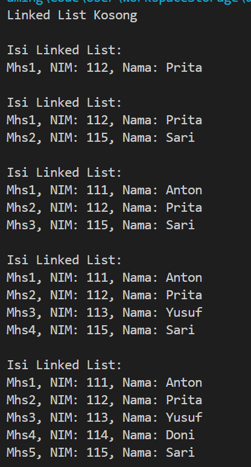</center>

  2. OUTPUT LATIHAN PRAKTIKUM 2:
     1. Menu Utama<br>
        <center>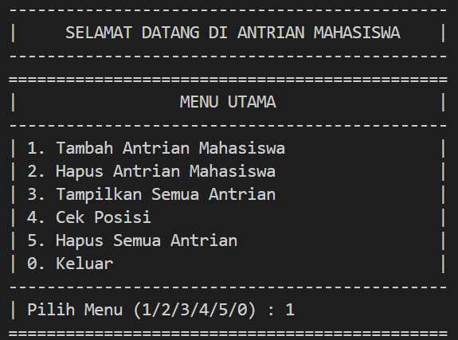</center>

     2. Menambahkan Antrian Mahasiswa Baru<br>
       - Menu Tambah Antrian<br>
            <center>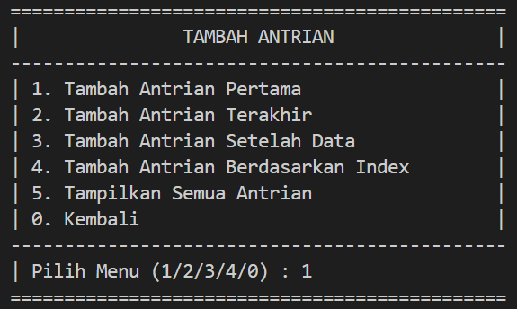</center>
 
       - Tambah Antrian Pertama<br>
            <center>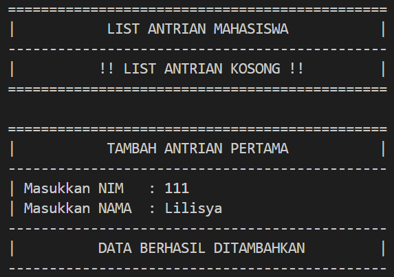</center>
 
       - Tambah Antrian Terakhir<br>
            <center>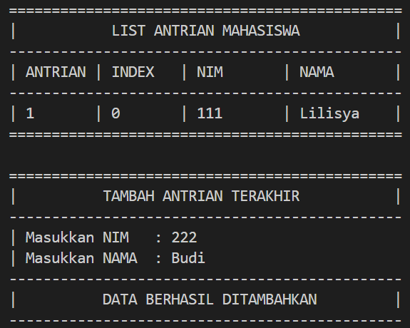</center>
     
       - Tambah Antrian Setelah Data<br>
         - Tambah Data Berhasil<br>
                <center>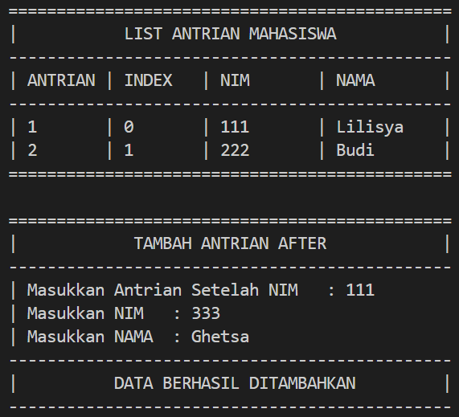</center>

         - Tambah Data Gagal<br>
                <center>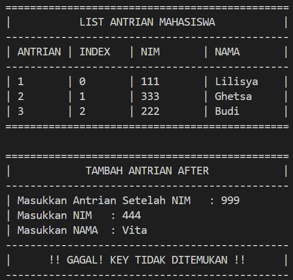</center>

       - Tambah Antrian Berdasarkan Index<br>
         - Tambah Data Berhasil<br>
            <center>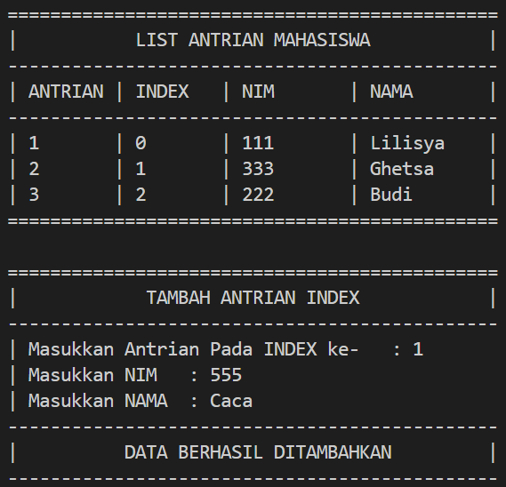</center>

         - Tambah Data Gagal (Index Negatif)<br>
            <center>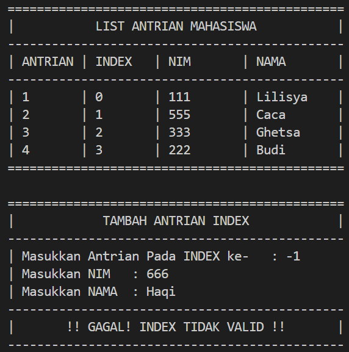</center>

         - Tambah Data Gagal (Index Diluar Jangkauan List)<br>
            <center>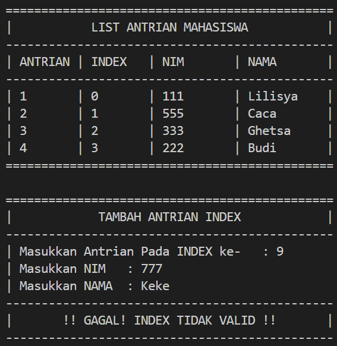</center>

     3. Menghapus Antrian Mahasiswa Baru<br>
       - Menu Hapus Antrian<br>
            <center>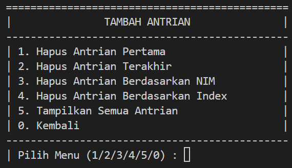</center>
 
       - Hapus Antrian Pertama<br>
            <center>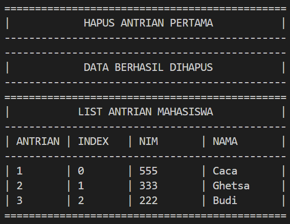</center>
 
       - Hapus Antrian Terakhir<br>
            <center>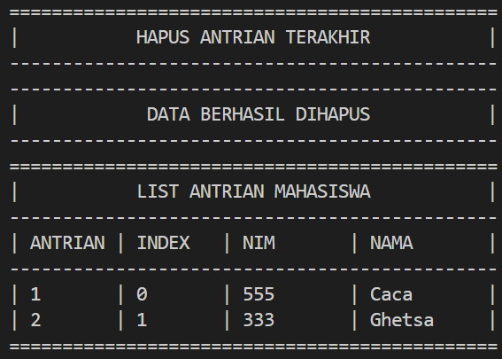</center>
     
       - Hapus Antrian Setelah Data<br>
            <center>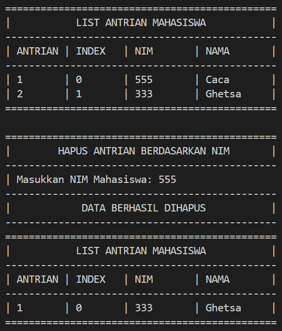</center>

       - Hapus Antrian Berdasarkan Index<br>
            <center>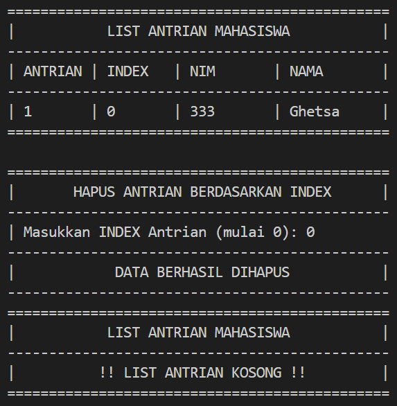</center>

     4. Menu Tampilkan Semua Antrian<br>
          <center>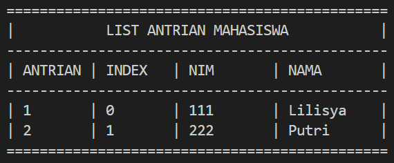</center>

     5. Cek Antrian Berdasarkan INDEX<br>
          <center>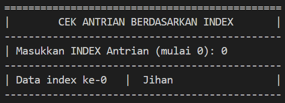</center>
 
     6. Cek Antrian Berdasarkan NIM<br>
          <center>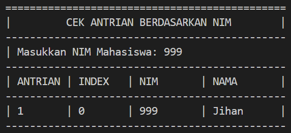</center>
 
     