# Laporan Praktikum Pertemuan 11
# DOUBLE LINKED LIST

<b>NAMA : GHETSA RAMADHANI RISKA ARRYANTI</b><br>
<b>KELAS : TI-1H</b><br>
<b>NIM : 2341720004</b><br>
<b>ABSEN : 12</b><br>

## 1.	Praktikum
### Percobaan 1

#### Hasil Percobaan

- Output yang diharapkan untuk percobaan 1<br>
    <center>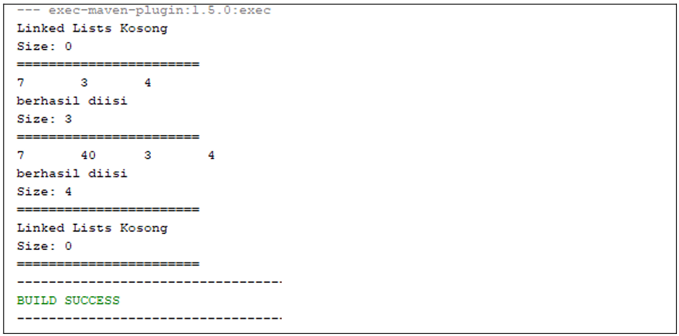</center>
    
- Output yang berhasil dibuat untuk percobaan 1<br>
    <center>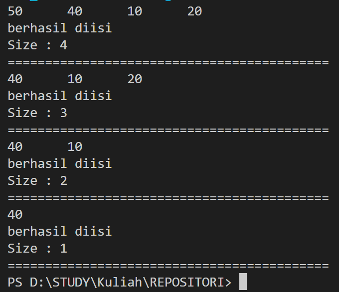</center>

---
#### Pertanyaan & Jawaban 1
- Pertanyaan: <br>
    1. Jelaskan perbedaan antara single linked list dengan double linked lists!<br>
    2. Perhatikan class Node, di dalamnya terdapat atribut next dan prev. Untuk apakah atribut tersebut? <br>
    3. Perhatikan konstruktor pada class DoubleLinkedLists. Apa kegunaan inisialisasi atribut head dan size seperti pada gambar berikut ini? <br>
        ```
            public DoubleLinkedLists() {
                head = null;
                size = 0;
            }
        ```     
    4. Pada method addFirst(), kenapa dalam pembuatan object dari konstruktor class Node prev dianggap sama dengan null? <br>
        `Node newNode = new Node(null, item, head); `<br>
    5. Perhatikan pada method addFirst().  Apakah arti statement head.prev = newNode ?<br>
    6. Perhatikan isi method addLast(), apa arti dari pembuatan object Node dengan mengisikan parameter prev dengan current, dan next dengan null? <br>
        `Node newNode = new Node(current, item, null); `<br>
    7. Pada method add(), terdapat potongan kode program sebagai berikut:<br>
        <center></center>
    jelaskan maksud dari bagian yang ditandai dengan kotak kuning. 


- Jawaban: <br>
    1. <br>
    2. <br>
    3. <br>
    4. <br>
    5. <br>
    6. <br>
    7. <br>
   
    
### Percobaan 3
#### Hasil Percobaan
- Output yang diharapkan untuk percobaan 2<br>
    <center></center>
    
- Output yang berhasil dibuat untuk percobaan 2<br>
    <center>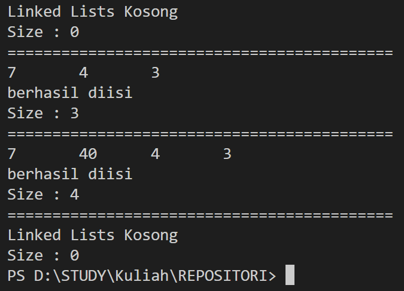</center>


#### Pertanyaan & Jawaban
- Pertanyaan: <br>
    1. Apakah maksud statement berikut pada method removeFirst()? <br>
        ```
            head = head.next; 
            head.prev = null;
        ```
    2. Bagaimana cara mendeteksi posisi data ada pada bagian akhir pada method removeLast()? <br>
    3. Jelaskan alasan potongan kode program di bawah ini tidak cocok untuk perintah remove! <br>
        ```
            Node tmp = head.next;

            head.next = tmp.next;
            tmp.next.prev = head;
        ```
    4. Jelaskan fungsi kode program berikut ini pada fungsi remove!<br>
        ```
            current.prev.next = current.next;
            current.next.prev = current.next;
        ```


- Jawaban: <br>
    1. <br>
    2. <br>
    3. <br>
    4. <br>

### Percobaan 3
#### Hasil Percobaan
- Output yang diharapkan untuk percobaan 3<br>
    <center>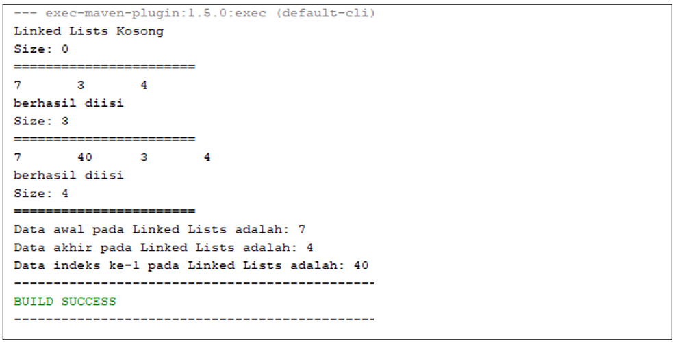</center>
    
- Output yang berhasil dibuat untuk percobaan 3<br>
    <center>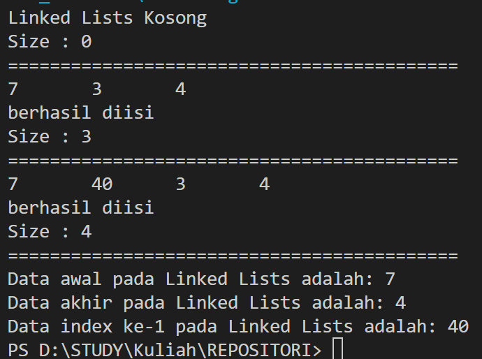</center>


#### Pertanyaan & Jawaban
- Pertanyaan: <br>
    1. Jelaskan method size() pada class DoubleLinkedLists!<br>
    2. Jelaskan cara mengatur indeks pada double linked lists supaya dapat dimulai dari indeks ke-1! <br>
    3. Jelaskan perbedaan karakteristik fungsi Add pada Double Linked Lists dan Single Linked Lists!<br>
    4. Jelaskan perbedaan logika dari kedua kode program di bawah ini!<br>
        <center></center>
        


- Jawaban: <br>
    1. <br>
    2. <br>
    3. <br>
    4. <br>

## LATIHAN 
### Tugas  :
- Soal<br>

    1. Buat program antrian vaksinasi menggunakan queue berbasis double linked list sesuai ilustrasi dan menu di bawah ini! (counter jumlah antrian tersisa di menu cetak(3) dan data orang yang telah divaksinasi di menu Hapus Data(2) harus ada) <br>
        Contoh Ilustrasi Program 
        <center>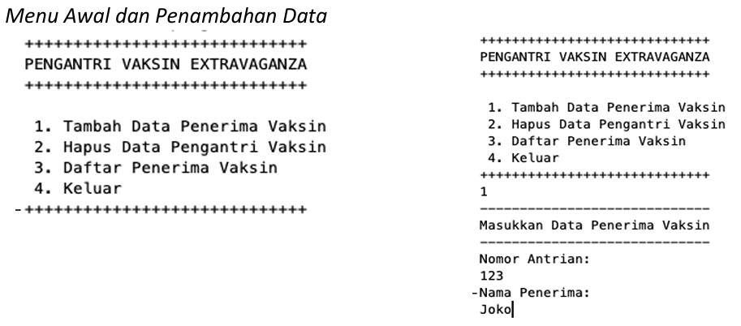</center>
        <center>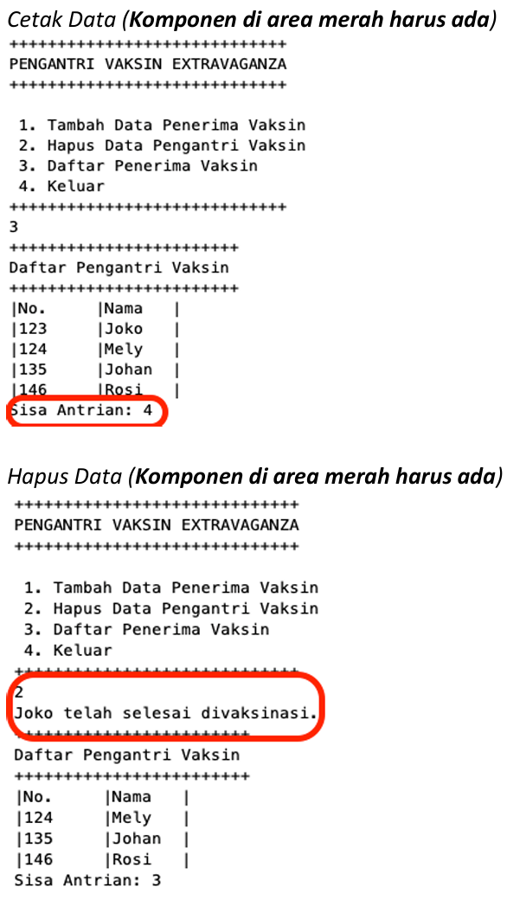</center>
    
    2. Buatlah program daftar film yang terdiri dari id, judul dan rating menggunakan double linked lists, bentuk program memiliki fitur pencarian melalui ID Film dan pengurutan Rating secara descending. Class Film wajib diimplementasikan dalam soal ini. <br>
        Contoh Ilustrasi Program 
        <center>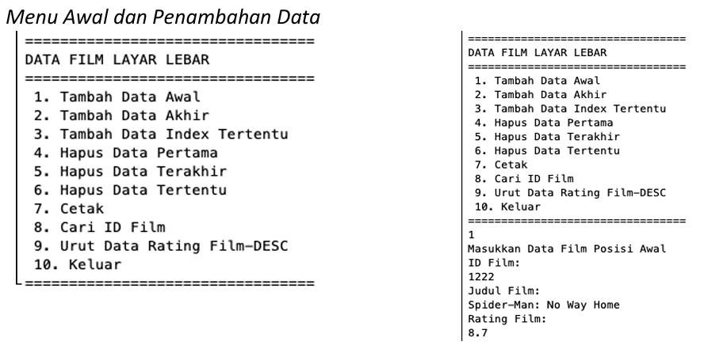</center>
        <center>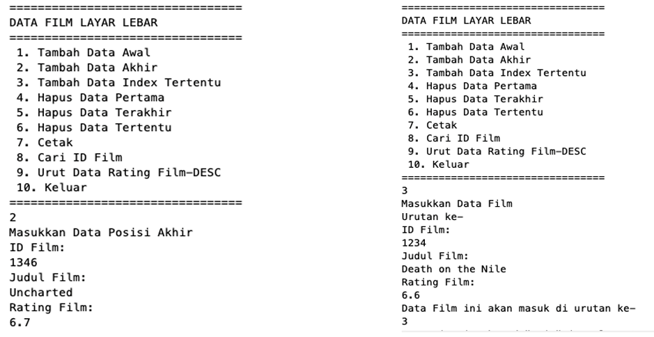</center>
        <center>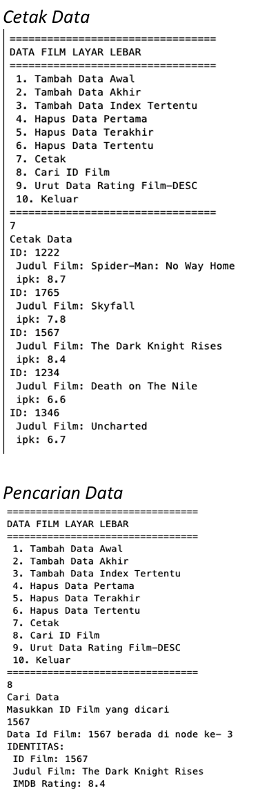</center>
    


- Hasil Output<br>
  
  1. OUTPUT LATIHAN PRAKTIKUM 1:
        <center></center>

  2. OUTPUT LATIHAN PRAKTIKUM 2:
     1. Menu Utama<br>
        <center></center>

     2. Menambahkan Antrian Mahasiswa Baru<br>
       - Menu Tambah Antrian<br>
            <center></center>
 
       - Tambah Antrian Pertama<br>
            <center></center>
 
       - Tambah Antrian Terakhir<br>
            <center></center>
     
       - Tambah Antrian Setelah Data<br>
         - Tambah Data Berhasil<br>
                <center></center>

         - Tambah Data Gagal<br>
                <center></center>

       - Tambah Antrian Berdasarkan Index<br>
         - Tambah Data Berhasil<br>
            <center></center>

         - Tambah Data Gagal (Index Negatif)<br>
            <center></center>

         - Tambah Data Gagal (Index Diluar Jangkauan List)<br>
            <center></center>

     3. Menghapus Antrian Mahasiswa Baru<br>
       - Menu Hapus Antrian<br>
            <center></center>
 
       - Hapus Antrian Pertama<br>
            <center></center>
 
       - Hapus Antrian Terakhir<br>
            <center>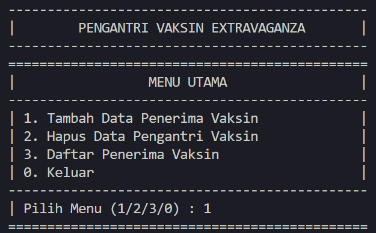</center>
     
       - Hapus Antrian Setelah Data<br>
            <center>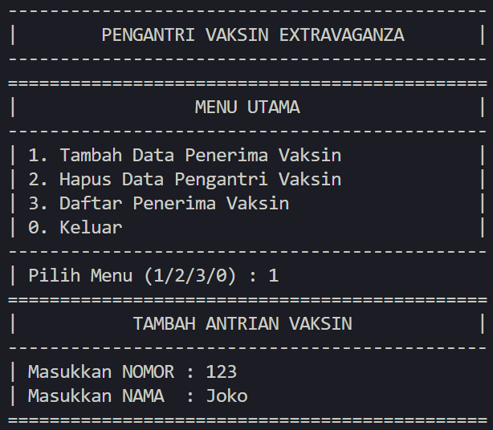</center>

       - Hapus Antrian Berdasarkan Index<br>
            <center>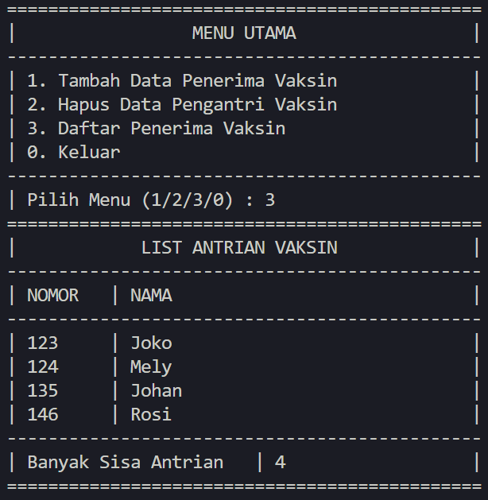</center>

     4. Menu Tampilkan Semua Antrian<br>
          <center></center>

     5. Cek Antrian Berdasarkan INDEX<br>
          <center></center>
 
     6. Cek Antrian Berdasarkan NIM<br>
          <center></center>
 
     