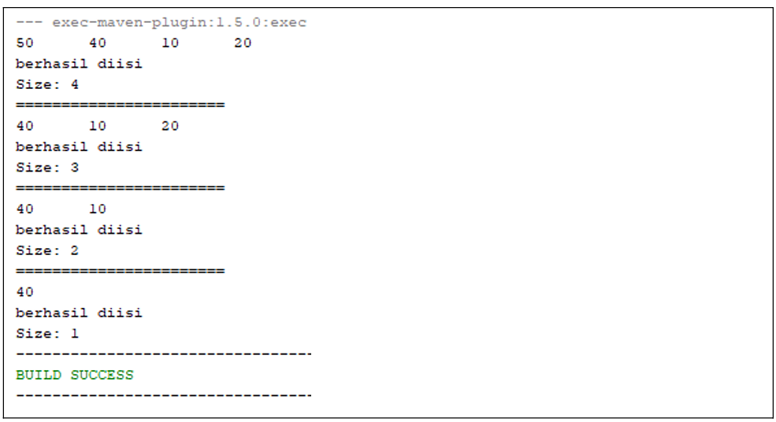
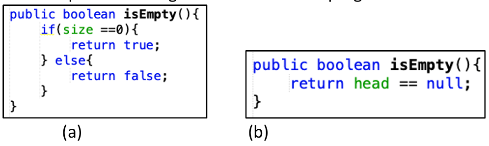

# Laporan Praktikum Pertemuan 11
# DOUBLE LINKED LIST

<b>NAMA : GHETSA RAMADHANI RISKA ARRYANTI</b><br>
<b>KELAS : TI-1H</b><br>
<b>NIM : 2341720004</b><br>
<b>ABSEN : 12</b><br>

## 1.	Praktikum
### Percobaan 1

#### Hasil Percobaan

- Output yang diharapkan untuk percobaan 1<br>
    <center></center>
    
- Output yang berhasil dibuat untuk percobaan 1<br>
    <center></center>

---
#### Pertanyaan & Jawaban 1
- Pertanyaan: <br>
    1. Jelaskan perbedaan antara single linked list dengan double linked lists!<br>
    2. Perhatikan class Node, di dalamnya terdapat atribut next dan prev. Untuk apakah atribut tersebut? <br>
    3. Perhatikan konstruktor pada class DoubleLinkedLists. Apa kegunaan inisialisasi atribut head dan size seperti pada gambar berikut ini? <br>
        ```
            public DoubleLinkedLists() {
                head = null;
                size = 0;
            }
        ```     
    4. Pada method addFirst(), kenapa dalam pembuatan object dari konstruktor class Node prev dianggap sama dengan null? <br>
        `Node newNode = new Node(null, item, head); `<br>
    5. Perhatikan pada method addFirst().  Apakah arti statement `head.prev = newNode` ?<br>
    6. Perhatikan isi method addLast(), apa arti dari pembuatan object Node dengan mengisikan parameter prev dengan current, dan next dengan null? <br>
        `Node newNode = new Node(current, item, null); `<br>
    7. Pada method add(), terdapat potongan kode program sebagai berikut:<br>
        <center></center>
    jelaskan maksud dari bagian yang ditandai dengan kotak kuning. 


- Jawaban: <br>
    1. Single Linked List memiliki 1 pointer yaitu next, sementara Double Linked List memiliki 2 pointer yaitu next dan prev<br>
    2. next: digunakan untuk menunjukkan node berikutnya, prev: digunakan untuk menunjukkan node sebelumnya<br>
    3. inisialisasi head dan size dengan `0` dan `null` dikarenakan saat membuat List pertama kali, List akan kosong <br>
    4. Karena prev dari node pertama akan selalu `null`, jadi jika ingin menambahkan node pertama, maka harus mengatur agar prev node tersebut menjadi `null`<br>
    5. `head.prev = newNode` digunakan untuk mengatur `head.prev` yang sebelumnya mengarah ke `null` menjadi ke node baru<br>
    6. Mengisi `prev` dengan `current` digunakan untuk membuat `prev` dari node baru menjadi node terakhir saat ini dan `next` (node berikutnya dari node baru) menjadi null<br>
    7. Blok kode tersebut digunakan jika current berada di awal list. Dengan membuat newNode dengan `prev` newNode adalah null dan `next` nya merupakan node pertama saat ini. Setelahnya akan membuat prev dari node pertama saat ini menjadi newNode, dan mengubah head menjadi newNode<br>
   
    
### Percobaan 2
#### Hasil Percobaan
- Output yang diharapkan untuk percobaan 2<br>
    <center></center>
    
- Output yang berhasil dibuat untuk percobaan 2<br>
    <center></center>


#### Pertanyaan & Jawaban
- Pertanyaan: <br>
    1. Apakah maksud statement berikut pada method removeFirst()? <br>
        ```
            head = head.next; 
            head.prev = null;
        ```
    2. Bagaimana cara mendeteksi posisi data ada pada bagian akhir pada method removeLast()? <br>
    3. Jelaskan alasan potongan kode program di bawah ini tidak cocok untuk perintah remove! <br>
        ```
            Node tmp = head.next;

            head.next = tmp.next;
            tmp.next.prev = head;
        ```
    4. Jelaskan fungsi kode program berikut ini pada fungsi remove!<br>
        ```
            current.prev.next = current.next;
            current.next.prev = current.next;
        ```


- Jawaban: <br>
    1. `head = head.next;` digunakan untuk menggeser head ke setelah head. `head.prev = null;` digunakan untuk mengubah prev dari head yang baru (head lama) menjadi null<br>
    2. Mendeteksi bagian akhir/tail dari list dengan melakukan pengecekan apakah next dari data adalah null. Terdapat pada kode `while (current.next.next != null) `<br>
    3. Kode tersebut tidak cocok karena hanya menghapus node kedua<br>
    4. `current.prev.next = current.next;` digunakan untuk mengatur pointer `next` dari node sebelumnya ke node setelah node yang akan dihapus, dan `current.next.prev = current.next;` digunakan untuk mengatur pointer `prev` dari node setelahnya ke node sebelum node yang akan dihapus.<br>

### Percobaan 3
#### Hasil Percobaan
- Output yang diharapkan untuk percobaan 3<br>
    <center></center>
    
- Output yang berhasil dibuat untuk percobaan 3<br>
    <center></center>


#### Pertanyaan & Jawaban
- Pertanyaan: <br>
    1. Jelaskan method `size()` pada class DoubleLinkedLists!<br>
    2. Jelaskan cara mengatur indeks pada double linked lists supaya dapat dimulai dari indeks ke-1! <br>
    3. Jelaskan perbedaan karakteristik fungsi Add pada Double Linked Lists dan Single Linked Lists!<br>
    4. Jelaskan perbedaan logika dari kedua kode program di bawah ini!<br>
        <center></center>
        


- Jawaban: <br>
    1. `size()` digunakan untuk me-return berapa jumlah node dalam linked list<br>
    2. Untuk mengatur indeks dimulai dari 1 pada double linked lists, cukup atur iterasi dan mengubah pointer pada method `add()` dan `get()` mulai dari 1 dan melakukan pengecekan jika `i` sama dengan `index`.<br>
    3. Pada Single Linked Lists hanya perlu mengubah 1 pointer saja(next), sementara pada Double Linked Lists perlu mengubah 2 pointer sehingga menjadi lebih kompleks<br>
    4. Kode a, mengecek apakah list kosong berdasarkan banyak node yang ada. Sementara kode b, memeriksa kekosongan berdasarkan apakah node pertama/head<br>

## LATIHAN 
### Tugas  :
#### Soal<br>

    1. Buat program antrian vaksinasi menggunakan queue berbasis double linked list sesuai ilustrasi dan menu di bawah ini! (counter jumlah antrian tersisa di menu cetak(3) dan data orang yang telah divaksinasi di menu Hapus Data(2) harus ada) <br>
        Contoh Ilustrasi Program 
        <center></center>
        <center></center>
    
    2. Buatlah program daftar film yang terdiri dari id, judul dan rating menggunakan double linked lists, bentuk program memiliki fitur pencarian melalui ID Film dan pengurutan Rating secara descending. Class Film wajib diimplementasikan dalam soal ini. <br>
        Contoh Ilustrasi Program 
        <center></center>
        <center></center>
        <center></center>
    


#### Hasil Output<br>
  
1. OUTPUT LATIHAN PRAKTIKUM 1:
   1. Menu Utama<br>
      <center></center>

   2. Tambah Data<br>
      <center></center>

   3. Tampilkan Daftar<br>
      <center></center>

   4. Hapus Data<br>
      <center></center>

2. OUTPUT LATIHAN PRAKTIKUM 2:
   1. Menu Utama<br>
      <center></center>

   2. Menambahkan Data Film<br>
        - Tambah Data Film Pertama<br>
             <center></center>

        - Tambah Data Film Terakhir<br>
             <center></center>

        - Tambah Data Film Berdasarkan Index<br>
             <center></center>

   3. Menghapus Data Film<br>
        - Hapus Data Film Pertama<br>
             <center></center>

        - Hapus Data Film Terakhir<br>
             <center></center>

        - Hapus Data Film Berdasarkan Urutan (Index +1)<br>
             <center></center>

   4. Menu Cetak Data Film<br>
        <center></center>

   5. Cari Data Film Berdasarkan ID<br>
        <center></center>

   6. Sorting Data Berdasarkan Rating Film - DESC<br>
        <center></center><br>
        <center></center>

     