# Laporan Praktikum Pertemuan 14
# TREE

<b>NAMA : GHETSA RAMADHANI RISKA ARRYANTI</b><br>
<b>KELAS : TI-1H</b><br>
<b>NIM : 2341720004</b><br>
<b>ABSEN : 12</b><br>

## 1.	Praktikum
### Percobaan 1

#### Hasil Percobaan

- Output yang diharapkan untuk percobaan 1<br>
    <center>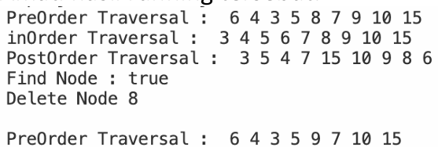</center>
    
- Output yang berhasil dibuat untuk percobaan 1<br>
    <center>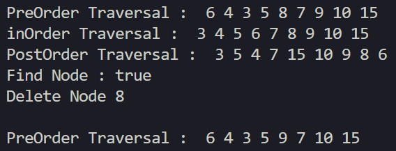</center>

---
#### Pertanyaan & Jawaban 1
- Pertanyaan: <br>
    1. Mengapa dalam binary search tree proses pencarian data bisa lebih efektif dilakukan dibanding binary tree biasa?<br>
    2. Untuk apakah di class Node, kegunaan dari atribut left dan right?<br>
    3. a. Untuk apakah kegunaan dari atribut root di dalam class BinaryTree?<br> b. Ketika objek tree pertama kali dibuat, apakah nilai dari root?<br>
    4. Ketika tree masih kosong, dan akan ditambahkan sebuah node baru, proses apa yang akan terjadi?<br>
    5. Perhatikan method add(), di dalamnya terdapat baris program seperti di bawah ini. Jelaskan secara detil untuk apa baris program tersebut? <br>
        ```
            if(data<current.data){ 
              if(current.left!=null){ 
                current = current.left; 
              }else{ 
                current.left = new Node(data); 
                break; 
              } 
            }
        ```     
    

- Jawaban: <br>
    1. Karena hanya perlu melakukan pencarian pada bagian elemen tertentu (jika lebih kecil akan mencari di elemen sebelah kiri, jika lebih besar akan mencari disebelah kanan).(<br>
    2. `left` digunakan untuk menunjukkan child sebelah kiri, `right` digunakan untuk menunjuk child sebelah kanan<br>
    3. a. Digunakan untuk menunjuk elemen pertama dari sebuah Tree<br> b. Ketika pertama dibuat, `root` akan bernilai `null` yang mengindikasikan bahwa `Tree` masih kosong<br>
    4. Node baru akan menjadi `root` dari `Tree`<br>
    5. `if(data<current.data){` : digunakan untuk mengecek apakah data yang dicari lebih kecil dari current data yang sedang dicek<br>
       `if(current.left!=null){`: Mengecek apakah current memiliki left child<br>
       `current = current.left;`: jika memiliki, akan memindahkan `current` menjadi left child dari `current`<br>
       `}else{` : jika node tidak memiliki left child<br>
       `current.left = new Node(data);` : membuat node baru menjadi left child dari `current`<br>
       `break;` menghentikan perulangan setelah data ditambahkan<br>
      
    
### Percobaan 2
#### Hasil Percobaan
- Output yang diharapkan untuk percobaan 2<br>
    <center>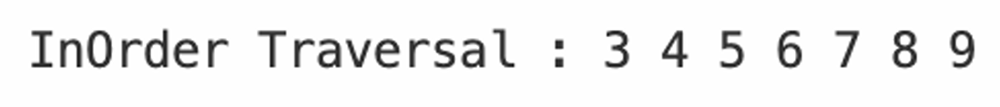</center>
    
- Output yang berhasil dibuat untuk percobaan 2<br>
    <center></center>


#### Pertanyaan & Jawaban
- Pertanyaan: <br>
    1. Apakah kegunaan dari atribut data dan idxLast yang ada di class BinaryTreeArray?<br>
    2. Apakah kegunaan dari method populateData()?<br>
    3. Apakah kegunaan dari method traverseInOrder()?<br>
    4. Jika suatu node binary tree disimpan dalam array indeks 2, maka di indeks berapakah posisi left child dan rigth child masin-masing?<br>
    5. Apa kegunaan statement int idxLast = 6 pada praktikum 2 percobaan nomor 4?<br>
        


- Jawaban: <br>
    1. data digunakan untuk menampung nilai/data dari node dalam Tree<br> idxLast digunakan untuk menampung indeks node terakhir<br>
    2. `populateData()` digunakan untuk mengisi array berdasarkan Binary Tree dan juga menentukan `idxLast`<br>
    3. `traverseInOrder()` digunakan untuk menampilkan/print node secara in-order (kiri, root, kanan)<br>
    4.  Jika node disimpan di indeks 2, left child ada di indeks 5 `(2*2+1)` dan right child ada di indeks 6 `(2*2+2)`.<br>
    5. `int idxLast = 6` Digunakan untuk menunjukkan bahwa elemen terakhir ada di indeks 6<br>

## LATIHAN 
### Tugas  :
- Soal<br>

    1. Buat method di dalam class BinaryTree yang akan menambahkan node dengan cara rekursif. <br>
    2. Buat method di dalam class BinaryTree untuk menampilkan nilai paling kecil dan yang paling besar yang ada di dalam tree. <br>
    3. Buat method di dalam class BinaryTree untuk menampilkan data yang ada di leaf.<br>
    4. Buat method di dalam class BinaryTree untuk menampilkan berapa jumlah leaf yang ada di dalam tree. <br>
    5. Modifikasi class BinaryTreeArray, dan tambahkan :  <br>
        - method add(int data) untuk memasukan data ke dalam tree <br>
        - method `traversePreOrder()` dan `traversePostOrder()`  <br>
        


- Hasil Output<br>
  
1. HASIL LATIHAN PRAKTIKUM 1
   CODES:<br>
   <center>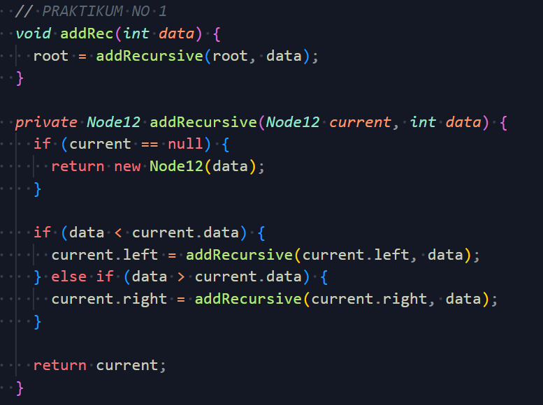</center><br>
   OUTPUT:<br>
   <center>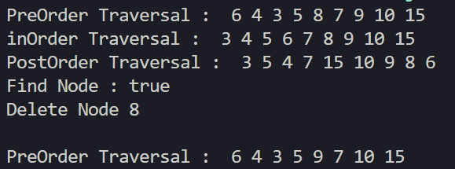</center><br>
  
2. HASIL LATIHAN PRAKTIKUM 2
   CODES:<br>
   <center>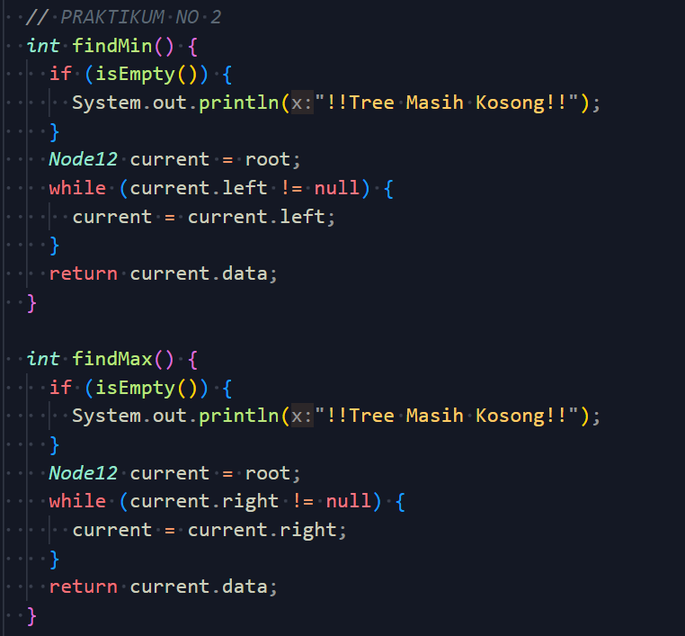</center><br>
   OUTPUT:<br>
   <center>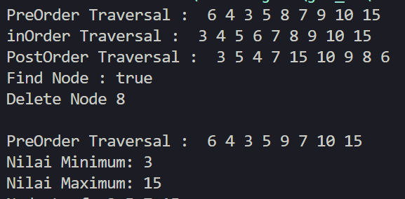</center><br>
  
3. HASIL LATIHAN PRAKTIKUM 3
   CODES:<br>
   <center>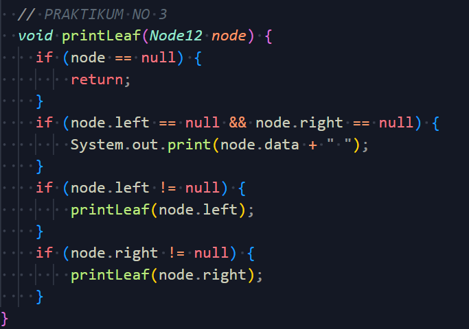</center><br>
   OUTPUT:<br>
   <center>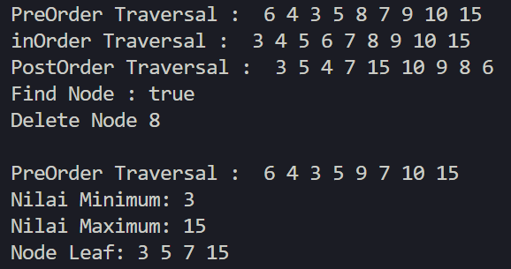</center><br>
  
4. HASIL LATIHAN PRAKTIKUM 4
   CODES:<br>
   <center>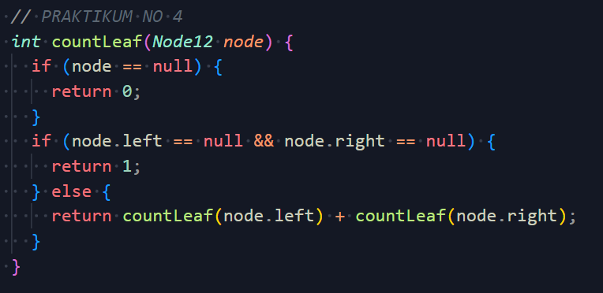</center><br>
   OUTPUT:<br>
   <center>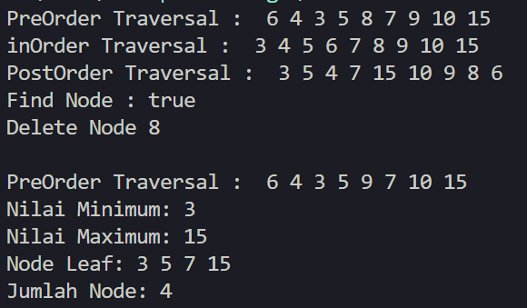</center><br>
  
5. HASIL LATIHAN PRAKTIKUM 5
   CODES:<br>
   <center>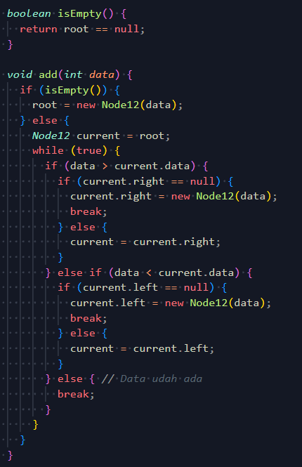</center><br>
   <center>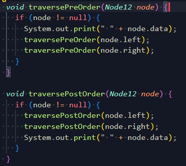</center><br>
   OUTPUT:<br>
   <center>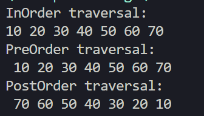</center>


     