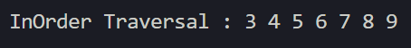

# Laporan Praktikum Pertemuan 14
# TREE

<b>NAMA : GHETSA RAMADHANI RISKA ARRYANTI</b><br>
<b>KELAS : TI-1H</b><br>
<b>NIM : 2341720004</b><br>
<b>ABSEN : 12</b><br>

## 1.	Praktikum
### Percobaan 1

#### Hasil Percobaan

- Output yang diharapkan untuk percobaan 1<br>
    <center></center>
    
- Output yang berhasil dibuat untuk percobaan 1<br>
    <center></center>

---
#### Pertanyaan & Jawaban 1
- Pertanyaan: <br>
    1. Mengapa dalam binary search tree proses pencarian data bisa lebih efektif dilakukan dibanding binary tree biasa?<br>
    2. Untuk apakah di class Node, kegunaan dari atribut left dan right?<br>
    3. a. Untuk apakah kegunaan dari atribut root di dalam class BinaryTree?<br> b. Ketika objek tree pertama kali dibuat, apakah nilai dari root?<br>
    4. Ketika tree masih kosong, dan akan ditambahkan sebuah node baru, proses apa yang akan terjadi?<br>
    5. Perhatikan method add(), di dalamnya terdapat baris program seperti di bawah ini. Jelaskan secara detil untuk apa baris program tersebut? <br>
        ```
            if(data<current.data){ 
              if(current.left!=null){ 
                current = current.left; 
              }else{ 
                current.left = new Node(data); 
                break; 
              } 
            }
        ```     
    

- Jawaban: <br>
    1. <br>
    2. <br>
    3. <br>
    4. <br>
    5. <br>
    
### Percobaan 2
#### Hasil Percobaan
- Output yang diharapkan untuk percobaan 2<br>
    <center></center>
    
- Output yang berhasil dibuat untuk percobaan 2<br>
    <center></center>


#### Pertanyaan & Jawaban
- Pertanyaan: <br>
    1. Apakah kegunaan dari atribut data dan idxLast yang ada di class BinaryTreeArray?<br>
    2. Apakah kegunaan dari method populateData()?<br>
    3. Apakah kegunaan dari method traverseInOrder()?<br>
    4. Jika suatu node binary tree disimpan dalam array indeks 2, maka di indeks berapakah posisi left child dan rigth child masin-masing?<br>
    5. Apa kegunaan statement int idxLast = 6 pada praktikum 2 percobaan nomor 4?<br>
        


- Jawaban: <br>
    1. <br>
    2. <br>
    3. <br>
    4. <br>
    5. <br>

## LATIHAN 
### Tugas  :
- Soal<br>

    1. Buat program antrian vaksinasi menggunakan queue berbasis double linked list sesuai ilustrasi dan menu di bawah ini! (counter jumlah antrian tersisa di menu cetak(3) dan data orang yang telah divaksinasi di menu Hapus Data(2) harus ada) <br>
        Contoh Ilustrasi Program 
        <center></center>
        <center></center>
    
    2. Buatlah program daftar film yang terdiri dari id, judul dan rating menggunakan double linked lists, bentuk program memiliki fitur pencarian melalui ID Film dan pengurutan Rating secara descending. Class Film wajib diimplementasikan dalam soal ini. <br>
        Contoh Ilustrasi Program 
        <center></center>
        <center></center>
        <center></center>
    


- Hasil Output<br>
  
1. OUTPUT LATIHAN PRAKTIKUM 1:
   1. Menu Utama<br>
        <center></center>

   2. Tambah Data<br>
        <center></center>

   3. Tampilkan Daftar<br>
        <center></center>

   4. Hapus Data<br>
        <center></center>

2. OUTPUT LATIHAN PRAKTIKUM 2:
   1. Menu Utama<br>
        <center></center>

   2. Menambahkan Data Film<br>
        - Tambah Data Film Pertama<br>
             <center></center>

        - Tambah Data Film Terakhir<br>
             <center></center>

        - Tambah Data Film Berdasarkan Index<br>
             <center></center>

   3. Menghapus Data Film<br>
        - Hapus Data Film Pertama<br>
             <center></center>

        - Hapus Data Film Terakhir<br>
             <center></center>

        - Hapus Data Film Berdasarkan Urutan (Index +1)<br>
             <center></center>

   4. Menu Cetak Data Film<br>
        <center></center>

   5. Cari Data Film Berdasarkan ID<br>
        <center></center>

   6. Sorting Data Berdasarkan Rating Film - DESC<br>
        <center></center><br>
        <center></center>

     