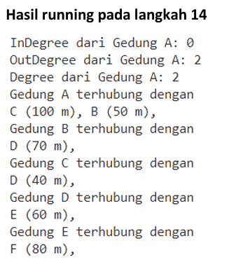
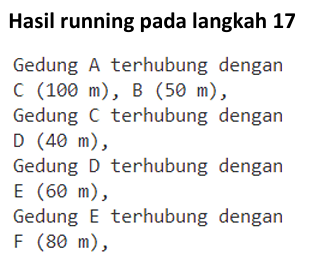
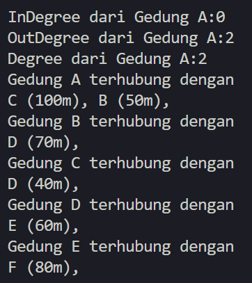
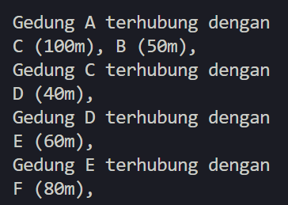
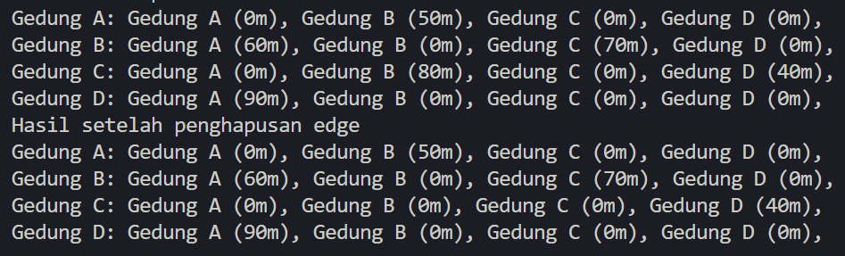
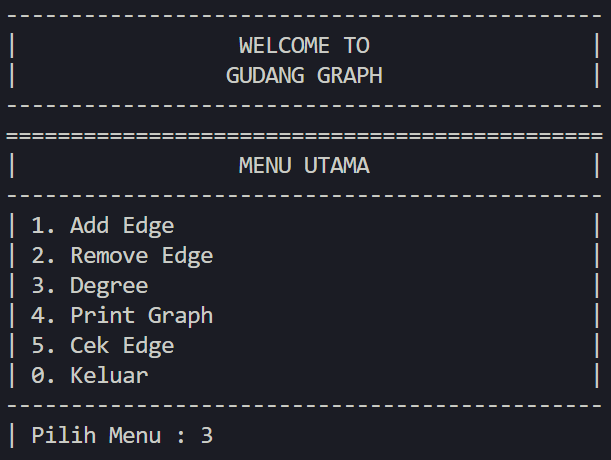
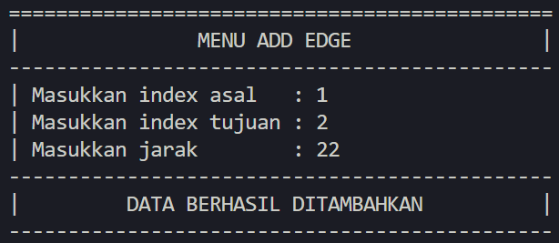
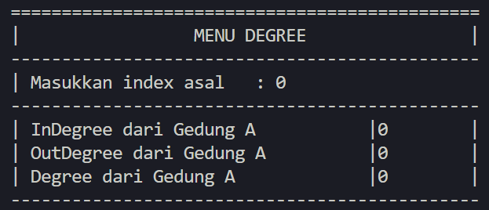
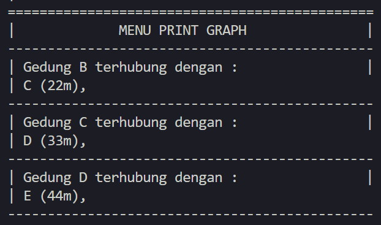
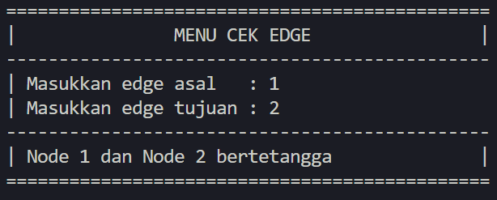

# Laporan Praktikum Pertemuan 15
# 
GRAPH

<b>NAMA : GHETSA RAMADHANI RISKA ARRYANTI</b> 
<b>KELAS : TI-1H</b> 
<b>NIM : 2341720004</b> 
<b>ABSEN : 12</b> 

## 1.	Praktikum
### Percobaan 1

#### Hasil Percobaan

- Output yang diharapkan untuk percobaan 1 
    

    

    
- Output yang berhasil dibuat untuk percobaan 1 
    

    

---
#### Pertanyaan & Jawaban 1
- Pertanyaan:  
    1. Perbaiki kode program Anda apabila terdapat error atau hasil kompilasi kode tidak sesuai!  
    2. Pada class Graph, terdapat atribut list[] bertipe DoubleLinkedList. Sebutkan tujuan pembuatan variabel tersebut!  
    3. Jelaskan alur kerja dari method `removeEdge`!  
    4. Apakah alasan pemanggilan method addFirst() untuk menambahkan data, bukan method add jenis lain saat digunakan pada method addEdge pada class Graph?  
    5. Modifikasi kode program sehingga dapat dilakukan pengecekan apakah terdapat jalur antara suatu node dengan node lainnya, seperti contoh berikut (Anda dapat memanfaatkan Scanner).  

- Jawaban:  
    1.  
    2.  
    3.  
    4.  
    5.  
    
### Percobaan 2
#### Hasil Percobaan
- Output yang diharapkan untuk percobaan 2 
    

    
- Output yang berhasil dibuat untuk percobaan 2 
    

#### Pertanyaan & Jawaban
- Pertanyaan:  
    1. Perbaiki kode program Anda apabila terdapat error atau hasil kompilasi kode tidak sesuai!  
    2. Apa jenis graph yang digunakan pada Percobaan 2?  
    3. Apa maksud dari dua baris kode berikut? 
    4. Modifikasi kode program sehingga terdapat method untuk menghitung degree, termasuk inDegree dan outDegree!  

- Jawaban:  
    1.  
    2.  
    3.  
    4.  
    5.  
    6. 

## LATIHAN 
### Tugas  :
- Soal 

    1.  
    2.  
    3.  

- Hasil Output 
  
1. HASIL LATIHAN PRAKTIKUM 1
   CODES: 
   

 
   OUTPUT: 
   

 
  
2. HASIL LATIHAN PRAKTIKUM 2
   CODES: 
   

 
   OUTPUT: 
   

 
  
3. HASIL LATIHAN PRAKTIKUM 3
   CODES: 
   

 
   OUTPUT: 
   

 
  
4. HASIL LATIHAN PRAKTIKUM 4
   CODES: 
   

 
   OUTPUT: 
   

 
  
5. HASIL LATIHAN PRAKTIKUM 5
   CODES: 
   

 
   

 
   OUTPUT: 
   

     