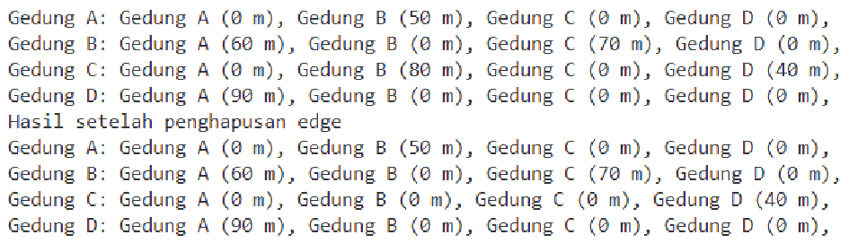

# Laporan Praktikum Pertemuan 15
# <center>GRAPH<center>

<b>NAMA : GHETSA RAMADHANI RISKA ARRYANTI</b><br>
<b>KELAS : TI-1H</b><br>
<b>NIM : 2341720004</b><br>
<b>ABSEN : 12</b><br>

## 1.	Praktikum
### Percobaan 1

#### Hasil Percobaan

- Output yang diharapkan untuk percobaan 1<br>
    <center></center>
    <center></center>
    
- Output yang berhasil dibuat untuk percobaan 1<br>
    <center></center>
    <center></center>

---
#### Pertanyaan & Jawaban 1
- Pertanyaan: <br>
    1. Perbaiki kode program Anda apabila terdapat error atau hasil kompilasi kode tidak sesuai! <br>
    2. Pada class Graph, terdapat atribut list[] bertipe DoubleLinkedList. Sebutkan tujuan pembuatan variabel tersebut! <br>
    3. Jelaskan alur kerja dari method `removeEdge`! <br>
    4. Apakah alasan pemanggilan method addFirst() untuk menambahkan data, bukan method add jenis lain saat digunakan pada method addEdge pada class Graph? <br>
    5. Modifikasi kode program sehingga dapat dilakukan pengecekan apakah terdapat jalur antara suatu node dengan node lainnya, seperti contoh berikut (Anda dapat memanfaatkan Scanner). <br>

- Jawaban: <br>
    1. Perbaikan terdapat pada source code<br>
    2. `list[]` digunakan untuk menyimpan data dari setiap vertex dalam graph<br>
    3.  a. melakukan looping untuk memindahkan `i` ke `tujuan` <br>
        b. melakukan pengecekan apakah `i` sama dengan `tujuan`<br>
        c. jika iya, maka akan memanggil method `remove` di class `DoubleLinkedList12`<br>
    4. Karena method addFirst() akan menambahkan data baru ke awal linked list segingga penambahan data dapat dilakukan dengan efisien dan cepat tanpa perlu traversing linked list.<br>
    5. <center></center><center></center>
<br>
    
### Percobaan 2
#### Hasil Percobaan
- Output yang diharapkan untuk percobaan 2<br>
    <center></center>
    
- Output yang berhasil dibuat untuk percobaan 2<br>
    <center></center>


#### Pertanyaan & Jawaban
- Pertanyaan: <br>
    1. Perbaiki kode program Anda apabila terdapat error atau hasil kompilasi kode tidak sesuai! <br>
    2. Apa jenis graph yang digunakan pada Percobaan 2? <br>
    3. Apa maksud dari dua baris kode berikut?<br>
        ```
        gdg.makeEdge(1,2,70);
        gdg.makeEdge(2,1,80);
        ```
    4. Modifikasi kode program sehingga terdapat method untuk menghitung degree, termasuk inDegree dan outDegree! <br>


- Jawaban: <br>
    1. <br>
    2. jenis graph yang digunakan adalah directed graph karena memiliki arah dari `asal` ke `tujuan`<br>
    3. Kode tersebut digunakan untuk membuat 2 edge dengan arah yang berbeda. Baris pertama digunakan untuk membuat edge dari vertex 1 ke vertex 2 dengan jarak 70, sementara beris kedua digunakan untuk membuat edge dari vertex 2 ke vertex 1 dengan jarak 80<br>
    4. <center></center><br>

## LATIHAN 
### Tugas  :
- Soal<br>

    1. Modifikasi kode program pada class GraphMain sehingga terdapat menu program yang bersifat dinamis, setidaknya terdiri dari: <br>
    a. Add Edge<br>
    b. Remove Edge<br>
    c. Degree<br>
    d. Print Graph<br>
    e. Cek Edge<br>
    Pengguna dapat memilih menu program melalui input Scanner<br>
    2. Tambahkan method updateJarak pada Percobaan 1 yang digunakan untuk mengubah jarak antara dua node asal dan tujuan!<br>
    3. Tambahkan method hitungEdge untuk menghitung banyaknya edge yang terdapat di dalam graf!<br>


- Hasil Output<br>
  
1. HASIL LATIHAN PRAKTIKUM 1
   MENU UTAMA<br>
   <center></center><br>
   MENU ADD EDGE<br>
   <center></center>
   <center></center><br>
   MENU REMOVE DEGREE<br>
   <center></center><br>
   MENU DEGREE<br>
   <center></center>
   <center></center><br>
   MENU PRINT GRAPH<br>
   <center></center><br>
   MENU CEK EDGE<br>
   <center></center>
   <center></center><br>
  
2. HASIL LATIHAN PRAKTIKUM 2
   CODES:<br>
   <center></center><br>
   <center></center><br>
   OUTPUT:<br>
   <center></center><br>
  
3. HASIL LATIHAN PRAKTIKUM 3
   CODES:<br>
   <center></center><br>
   <center></center><br>
   OUTPUT:<br>
   <center></center><br>


     